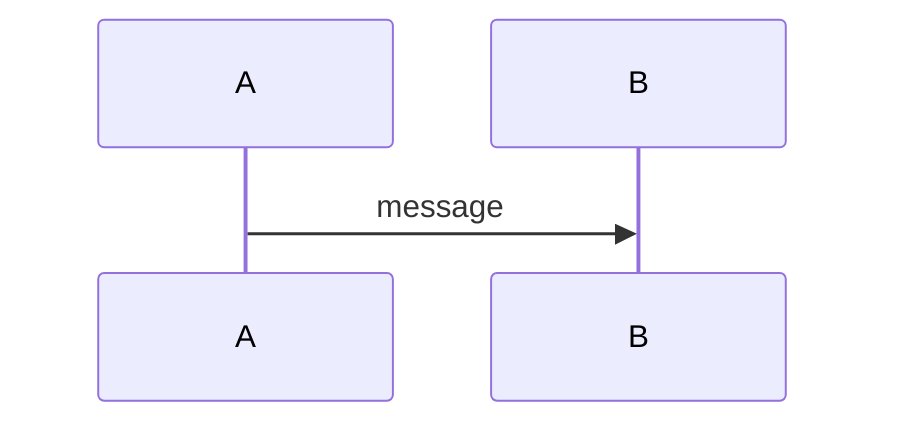
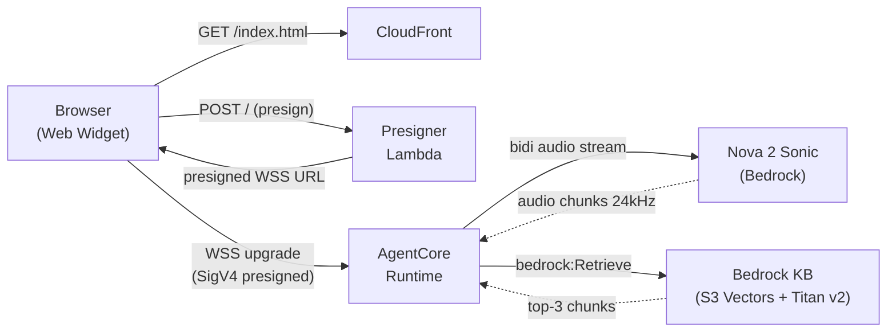
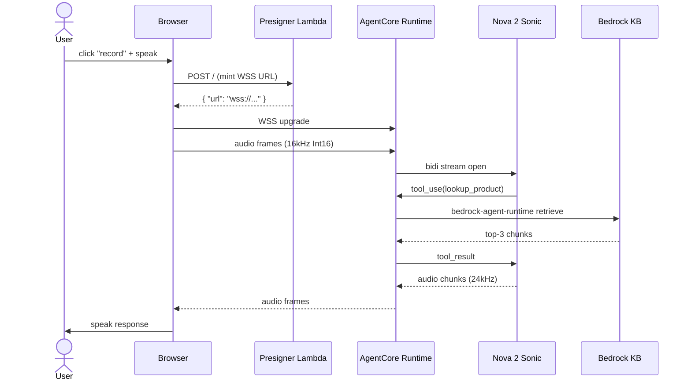

<objective>
Land the **DOC-12 parity gate first** so every subsequent chapter PR is forced to ship vi+en together (D-49 + D-50). Land the **config.toml replacement** so the Hugo site can build with real Hera values (D-52). Land **Phần 1 Introduction (vi+en)** as the first real chapter — single-page, Mermaid component + sequence diagrams (D-55), the bilingual-parity pitfall callout (D-51 #7), and the workshop "why this stack" intro that frames the rest of Phase 5. Delete the FCJ-template scaffold sub-pages under `2-preparation/` and `3-hands-on/` that the Phase 5 chapter plan does not use, plus delete BOTH `content/{vi,en}/1-introduction/1.1-prerequisites.md` files (Option A per D-53) — Phần 1 stays single-page (D-41) and the prereqs content is folded into the Phần 1 chapter as a `## Yêu cầu trước khi bắt đầu` H2 section.

This plan is non-autonomous because `config.toml` `baseURL` requires operator confirmation: the local repo has no `origin` remote configured (verified via `git remote -v`); CONTEXT D-52 + PATTERNS.md flag this as the one operator-gated input.

**Filesystem ground truth (verified 2026-05-07):** today vi=11, en=11 with identical structure. Both `content/{vi,en}/1-introduction/1.1-prerequisites.md` exist (PATTERNS.md inventory was wrong on this point — trust the filesystem). The 8 stub-slug dirs to delete are `content/{vi,en}/2-preparation/{2.1-create-vpc,2.2-create-ec2}/` (D-41 single-page Phần 2) and `content/{vi,en}/3-hands-on/{3.1-step-one,3.2-step-two}/` (D-40 renames Phần 3 sub-pages to 3.1-knowledge-base / 3.2-pipecat-local / 3.3-deploy-agentcore / 3.4-web-widget / 3.5-observability — none of which match `step-one` / `step-two`).

**Commit ordering (per checker BLOCKER 2 remedy option (a)):** Task 5 (stub deletions + 1.1-prerequisites deletions) lands FIRST as its own commit, BEFORE the parity gate is wired into `deploy.yml` in Task 2. This way each commit leaves the tree parity-clean and the gate never blocks its own enabling commit. Final commit order: 5 → 1 → 2 → 4 → 6.

Purpose: gate-first authoring discipline (parity check fails the workflow on file-count mismatch); learner-facing chapter 1 publishable; Phase 5 ready to parallelize chapter authoring in Wave 2.

Output:
- 1 new bash script (`bin/check-i18n-parity.sh`).
- 1 modified workflow file (`.github/workflows/deploy.yml`).
- 1 modified Hugo config (`config.toml`).
- 4 modified `_index.md` files (root index vi+en + Phần 1 vi+en).
- 2 deleted `1.1-prerequisites.md` files (both vi and en — Option A per D-53; content folded into Phần 1).
- 8 deleted FCJ-template stub directories under `content/{vi,en}/{2-preparation/{2.1-create-vpc,2.2-create-ec2}, 3-hands-on/{3.1-step-one,3.2-step-two}}/_index.md` (template scaffolding that does not match the Phase 5 chapter plan; PATTERNS.md flagged for deletion).
- **Final tree counts: vi=6, en=6** (root `_index.md` + 5 chapter `_index.md` per side).
</objective>

<execution_context>
@C:/Users/trant/projects/hera/.claude/get-shit-done/workflows/execute-plan.md
@C:/Users/trant/projects/hera/.claude/get-shit-done/templates/summary.md
</execution_context>

<context>
@.planning/PROJECT.md
@.planning/ROADMAP.md
@.planning/STATE.md
@.planning/REQUIREMENTS.md
@.planning/phases/05-workshop-documentation-vi-en/05-CONTEXT.md
@.planning/phases/05-workshop-documentation-vi-en/05-PATTERNS.md
@CLAUDE.md
@AGENTS.md

# Source files this plan reads (current state)
@config.toml
@.github/workflows/deploy.yml
@content/vi/_index.md
@content/en/_index.md
@content/vi/1-introduction/_index.md
@content/en/1-introduction/_index.md
@content/vi/1-introduction/1.1-prerequisites.md
@content/en/1-introduction/1.1-prerequisites.md

# Closest pattern analogs
@bin/cleanup-verify.sh
@bin/verify-kb.sh
@content/vi/4-cleanup/_index.md

<interfaces>
<!-- Key contracts the executor needs. Embedded so no codebase exploration is required. -->

Bash script header convention (from bin/cleanup-verify.sh lines 1-22):
```bash
#!/usr/bin/env bash
# bin/<name>.sh - <Phase X> <REQ-ID> <one-line purpose> (<D-XX>).
# <2-3 line description>
#
# Usage:  bash bin/<name>.sh
# Reads:  <inputs>
# Effect: <effect>

set -euo pipefail

command -v <tool> >/dev/null 2>&1 || { echo "ERROR: <tool> not found on PATH" >&2; exit 2; }
```

PASS/FAIL counter idiom (from bin/cleanup-verify.sh lines 30-31, 170-194):
```bash
PASS_COUNT=0
FAIL_COUNT=0
# ... checks increment counters ...
TOTAL=$((PASS_COUNT + FAIL_COUNT))
echo "----------------------------------------"
echo "<script-name>: ${PASS_COUNT}/${TOTAL} <unit> passed"
if [[ "${FAIL_COUNT}" -gt 0 ]]; then
  echo "" >&2
  echo "FAIL: ${FAIL_COUNT} <unit> failed." >&2
  echo "Hints:" >&2
  echo "  - <hint 1>" >&2
  exit 1
fi
echo "OK: <success message>"
exit 0
```

Hugo chapter-index single-page front-matter (from content/vi/4-cleanup/_index.md lines 1-7):
```markdown
---
title: "Dọn dẹp tài nguyên"   # vi: Vietnamese title; en: English title
date: 2025-01-01
weight: N                       # 1..5 matching chapter ordinal
chapter: true
pre: "<b>N. </b>"               # bold chapter prefix
---
```

Notice shortcode (from content/{vi,en}/1-introduction/1.1-prerequisites.md):
```markdown
{}
**<Title>:** <body>
{}
```

Variants the theme renders: `notice info`, `notice warning`, `notice tip`, `notice note`.

Mermaid fenced block (theme supports Goldmark passthrough; unsafe = true already set in config.toml line 37):
````markdown

````

Both vi and en files use the SAME Mermaid source (identifiers are language-agnostic); only surrounding prose translates. Parity-safe.

Workflow step shape (from .github/workflows/deploy.yml lines 32-41):
```yaml
      - name: Checkout
        uses: actions/checkout@v4
        with:
          submodules: recursive
          fetch-depth: 0

      - name: Setup Pages
        id: pages
        uses: actions/configure-pages@v5
```

Default shell at file level (lines 17-19): `defaults: run: shell: bash` — new `run:` steps inherit bash; no extra `shell:` key needed.
</interfaces>
</context>

<tasks>

<task type="auto">
  <name>Task 5 (commit-order #1): Delete FCJ-template stub sub-pages and BOTH 1.1-prerequisites.md files (D-53 Option A)</name>
  <files>
    content/vi/2-preparation/2.1-create-vpc/_index.md,
    content/vi/2-preparation/2.2-create-ec2/_index.md,
    content/en/2-preparation/2.1-create-vpc/_index.md,
    content/en/2-preparation/2.2-create-ec2/_index.md,
    content/vi/3-hands-on/3.1-step-one/_index.md,
    content/vi/3-hands-on/3.2-step-two/_index.md,
    content/en/3-hands-on/3.1-step-one/_index.md,
    content/en/3-hands-on/3.2-step-two/_index.md,
    content/vi/1-introduction/1.1-prerequisites.md,
    content/en/1-introduction/1.1-prerequisites.md
  </files>
  <read_first>
    - content/vi/2-preparation/2.1-create-vpc/_index.md (template stub — confirm content)
    - content/en/2-preparation/2.1-create-vpc/_index.md (template stub — confirm content)
    - content/vi/3-hands-on/3.1-step-one/_index.md (template stub)
    - content/vi/1-introduction/1.1-prerequisites.md (existing vi file — D-53 Option A input)
    - content/en/1-introduction/1.1-prerequisites.md (existing en file — D-53 Option A input)
    - .planning/phases/05-workshop-documentation-vi-en/05-CONTEXT.md (D-41: Phần 2 stays single-page; D-40: Phần 3 sub-page slugs are 3.1-knowledge-base, 3.2-pipecat-local, 3.3-deploy-agentcore, 3.4-web-widget, 3.5-observability; D-53: 1.1-prerequisites repurpose-or-remove decision)
  </read_first>
  <action>
**This task runs FIRST in commit order so the parity tree is clean before Task 2 wires the gate into deploy.yml.**

**Step A: Delete 8 FCJ-template stub directories (and their `_index.md` contents) that do not match the Phase 5 chapter plan:**

These are template scaffolding from `hugo-theme-learn`'s starter; D-41 keeps Phần 2 single-page (no sub-pages), and D-40 renames Phần 3 sub-pages to 3.1-knowledge-base / 3.2-pipecat-local / 3.3-deploy-agentcore / 3.4-web-widget / 3.5-observability (none of which match `3.1-step-one` / `3.2-step-two`).

```bash
rm -rf content/vi/2-preparation/2.1-create-vpc
rm -rf content/vi/2-preparation/2.2-create-ec2
rm -rf content/en/2-preparation/2.1-create-vpc
rm -rf content/en/2-preparation/2.2-create-ec2
rm -rf content/vi/3-hands-on/3.1-step-one
rm -rf content/vi/3-hands-on/3.2-step-two
rm -rf content/en/3-hands-on/3.1-step-one
rm -rf content/en/3-hands-on/3.2-step-two
```

**Step B: Resolve D-53 — delete BOTH `1.1-prerequisites.md` files (Option A per checker recommendation):**

Filesystem-verified state today (2026-05-07): both files exist.
- `content/vi/1-introduction/1.1-prerequisites.md` — exists, 740 bytes, title "1.1 Yêu cầu", contains AWS Account checklist + tools table + cost notice-warning.
- `content/en/1-introduction/1.1-prerequisites.md` — exists, English equivalent stub.

D-53 gives planner discretion. **Decision: REMOVE BOTH (Option A).** Rationale:
- D-41 explicitly keeps Phần 1 single-page; introducing a 1.1 sub-page would contradict D-41 and add a sub-page chapter just for prereqs that already belong in Phần 2 Preparation (the dedicated checklist chapter — Plan 05-02).
- Both files are shallow stubs ("AWS Account / IAM admin / AWS CLI / Browser") and will be properly written in Phần 2 (Plan 05-02).
- Per checker recommendation: Option A honors D-41 strictly without scope expansion.
- The Phần 1 chapter (authored in Task 6) folds the relevant prereqs prose into a `## Yêu cầu trước khi bắt đầu` H2 section so learners still see the cost-warning callout in chapter 1 before reaching Phần 2's full checklist.

```bash
rm content/vi/1-introduction/1.1-prerequisites.md
rm content/en/1-introduction/1.1-prerequisites.md
```

**Step C: Verify clean tree shape (read-only).**

After both deletion steps:
- `find content/vi -name "_index.md" -type f | wc -l` should equal 5 (root + 5 chapter indexes — Phần 1 still has its `_index.md`; only the 1.1-prerequisites.md sub-page file and 4 stub dir `_index.md` files were removed; Phần 1 chapter `_index.md` stays).
- Same shape for `content/en/`.
- File-count parity holds: vi=5 _index.md, en=5 _index.md (root index will be touched by Task 6, doesn't affect count). Wait — re-derive precisely:

  Pre-task today: vi=11, en=11 _index.md count.
  - Remove 4 stub `_index.md` files from vi (`2.1-create-vpc/_index.md`, `2.2-create-ec2/_index.md`, `3.1-step-one/_index.md`, `3.2-step-two/_index.md`).
  - Same 4 from en.
  - The 1.1-prerequisites.md files do NOT have an `_index.md` name, so they are NOT counted by parity script's `_index.md` filter. But removing them keeps the file inventory clean.

  Post-Step-A: vi=7 (11-4), en=7 (11-4). After Step B: still vi=7, en=7 (1.1-prereq isn't counted).

Wait — let me recount. vi=11 was the FULL `*.md` count, not the `_index.md` count. The parity script only counts `_index.md` files. Re-derive:

  Pre-task `_index.md` count today:
  - `content/vi/_index.md` (root)
  - `content/vi/1-introduction/_index.md`
  - `content/vi/2-preparation/_index.md`
  - `content/vi/2-preparation/2.1-create-vpc/_index.md` ← stub, will delete
  - `content/vi/2-preparation/2.2-create-ec2/_index.md` ← stub, will delete
  - `content/vi/3-hands-on/_index.md`
  - `content/vi/3-hands-on/3.1-step-one/_index.md` ← stub, will delete
  - `content/vi/3-hands-on/3.2-step-two/_index.md` ← stub, will delete
  - `content/vi/4-cleanup/_index.md`
  - `content/vi/5-summary/_index.md`
  vi `_index.md` count today = 10. Remove 4 stubs → vi `_index.md` count = 6. Same for en.

  The vi=11/en=11 number from filesystem ground truth includes the 1 non-`_index.md` file (`content/vi/1-introduction/1.1-prerequisites.md`) that is also today on the en side.

  **After this task: vi=6 `_index.md` files, en=6 `_index.md` files** (root + 5 chapter indexes per side). Parity holds.

**Verification commands:**

```bash
find content/vi -name "_index.md" -type f | wc -l   # expect: 6
find content/en -name "_index.md" -type f | wc -l   # expect: 6
test ! -e content/vi/1-introduction/1.1-prerequisites.md
test ! -e content/en/1-introduction/1.1-prerequisites.md
# bin/check-i18n-parity.sh does not exist yet at this point in commit ordering;
# parity confirmed by manual file-count + slug-tree comparison until Task 1 ships the script.
diff <(find content/vi -name "_index.md" -type f | sed 's|^content/vi/||' | sort) \
     <(find content/en -name "_index.md" -type f | sed 's|^content/en/||' | sort)
# expect: empty diff (slug parity)
```

Per D-40 / D-41 / D-53 / D-50.
  </action>
  <verify>
    <automated>test ! -e content/vi/2-preparation/2.1-create-vpc && test ! -e content/vi/2-preparation/2.2-create-ec2 && test ! -e content/en/2-preparation/2.1-create-vpc && test ! -e content/en/2-preparation/2.2-create-ec2 && test ! -e content/vi/3-hands-on/3.1-step-one && test ! -e content/vi/3-hands-on/3.2-step-two && test ! -e content/en/3-hands-on/3.1-step-one && test ! -e content/en/3-hands-on/3.2-step-two && test ! -e content/vi/1-introduction/1.1-prerequisites.md && test ! -e content/en/1-introduction/1.1-prerequisites.md && [ "$(find content/vi -name '_index.md' -type f | wc -l | tr -d ' ')" = "6" ] && [ "$(find content/en -name '_index.md' -type f | wc -l | tr -d ' ')" = "6" ]</automated>
  </verify>
  <acceptance_criteria>
    - All 8 stub directories under `content/{vi,en}/{2-preparation/{2.1-create-vpc,2.2-create-ec2}, 3-hands-on/{3.1-step-one,3.2-step-two}}` are gone (`test ! -e <path>` exits 0 for each).
    - BOTH `content/vi/1-introduction/1.1-prerequisites.md` AND `content/en/1-introduction/1.1-prerequisites.md` no longer exist.
    - `find content/vi -name "_index.md" -type f | wc -l` returns exactly 6.
    - `find content/en -name "_index.md" -type f | wc -l` returns exactly 6.
    - Slug-tree parity: `diff <(find content/vi -name "_index.md" -type f | sed 's|^content/vi/||' | sort) <(find content/en -name "_index.md" -type f | sed 's|^content/en/||' | sort)` produces empty output.
    - `find content/vi -name "_index.md" -type f` lists exactly: `content/vi/_index.md`, `content/vi/1-introduction/_index.md`, `content/vi/2-preparation/_index.md`, `content/vi/3-hands-on/_index.md`, `content/vi/4-cleanup/_index.md`, `content/vi/5-summary/_index.md` (6 files; root + 5 chapters).
    - Same shape for `content/en/` (6 files; root + 5 chapters).
    - `git status` shows the 10 deletions cleanly (8 stub `_index.md` + 2 `1.1-prerequisites.md`); no other files touched in this task.
  </acceptance_criteria>
  <done>FCJ-template stubs purged; both `1.1-prerequisites.md` files removed (D-53 Option A); tree is parity-clean with vi=6, en=6 `_index.md` count, ready for Task 1's parity script to land in commit #2.</done>
</task>

<task type="auto">
  <name>Task 1 (commit-order #2): Ship bin/check-i18n-parity.sh DOC-12 file-count parity gate</name>
  <files>bin/check-i18n-parity.sh</files>
  <read_first>
    - bin/cleanup-verify.sh (PASS/FAIL counter pattern, exit-with-hints idiom, lines 1-70 + 170-194)
    - bin/verify-kb.sh (preflight pattern, lines 33-35)
    - .planning/phases/05-workshop-documentation-vi-en/05-CONTEXT.md (D-50 minimal file-count parity spec)
    - .planning/phases/05-workshop-documentation-vi-en/05-PATTERNS.md (Pattern S7 + S8; bin/check-i18n-parity.sh section)
  </read_first>
  <action>
Create `bin/check-i18n-parity.sh` (executable, `set -euo pipefail`, English-only error messages per CLAUDE.md). Implements D-50 minimal file-count parity. **Runs against the cleaned tree from Task 5 — vi=6, en=6.**

1. Header docstring per Pattern S8 (cite Phase 5 DOC-12, D-50). Format: `bin/check-i18n-parity.sh - Phase 5 DOC-12 parity gate (D-50). Asserts content/vi and content/en have matching _index.md file structure. Read-only; never writes.`

2. Preflight per Pattern S7: `command -v find`, `command -v sort`, `command -v diff` — exit 2 with hint on miss. NO `aws` / `jq` requirement (this script is local-only — no AWS calls per D-50; drop the HERA_REGION boilerplate from cleanup-verify.sh).

3. Compute repo root: `REPO_ROOT="$(cd "$(dirname "$0")/.." && pwd)"; cd "$REPO_ROOT"`. Without this the `find content/vi` paths resolve wrong when invoked from a sub-dir.

4. Two checks, both increment shared `PASS_COUNT` / `FAIL_COUNT`:

   **Check 1 — file count parity:**
   ```bash
   VI_COUNT=$(find content/vi -name "_index.md" -type f | wc -l | tr -d ' ')
   EN_COUNT=$(find content/en -name "_index.md" -type f | wc -l | tr -d ' ')
   if [[ "${VI_COUNT}" -eq "${EN_COUNT}" ]]; then
     echo "OK: file count parity (vi=${VI_COUNT}, en=${EN_COUNT})"
     PASS_COUNT=$((PASS_COUNT + 1))
   else
     echo "FAIL: file count mismatch (vi=${VI_COUNT}, en=${EN_COUNT})"
     FAIL_COUNT=$((FAIL_COUNT + 1))
   fi
   ```

   **Check 2 — bidirectional slug parity** (catches a slug rename in either side):
   ```bash
   # Strip the language root prefix and sort both lists; diff must be empty.
   VI_SLUGS=$(find content/vi -name "_index.md" -type f | sed 's|^content/vi/||' | sort)
   EN_SLUGS=$(find content/en -name "_index.md" -type f | sed 's|^content/en/||' | sort)
   DIFF_OUT=$(diff <(echo "${VI_SLUGS}") <(echo "${EN_SLUGS}") || true)
   if [[ -z "${DIFF_OUT}" ]]; then
     echo "OK: vi/en slug tree parity"
     PASS_COUNT=$((PASS_COUNT + 1))
   else
     echo "FAIL: slug tree mismatch:"
     echo "${DIFF_OUT}"
     FAIL_COUNT=$((FAIL_COUNT + 1))
   fi
   ```

5. Final tally + exit per Pattern S7:
   ```bash
   TOTAL=$((PASS_COUNT + FAIL_COUNT))
   echo "----------------------------------------"
   echo "check-i18n-parity: ${PASS_COUNT}/${TOTAL} parity assertions passed"
   if [[ "${FAIL_COUNT}" -gt 0 ]]; then
     echo "" >&2
     echo "FAIL: ${FAIL_COUNT} parity violation(s) (DOC-12)." >&2
     echo "Hints:" >&2
     echo "  - Did you author vi+en in the same commit (D-49)?" >&2
     echo "  - Slug missing on one side? Add the matching _index.md." >&2
     echo "  - Slug renamed on one side? Rename on the other side too." >&2
     exit 1
   fi
   echo "OK: vi/en _index.md tree parity (DOC-12)"
   exit 0
   ```

6. `chmod +x bin/check-i18n-parity.sh` after writing.

Constraints:
- No emojis; English-only messages (per CLAUDE.md and bin/cleanup-verify.sh precedent).
- Zero AWS calls; no `HERA_REGION`.
- No `try/except`-style fallback masking; missing tools exit 2 with install hint.
- Use `<()` process substitution (bash-only — fine because the workflow file declares `defaults: run: shell: bash` and operator runs `bash bin/check-i18n-parity.sh`).

Per D-50 / D-12 / Pattern S6.
  </action>
  <verify>
    <automated>bash -n bin/check-i18n-parity.sh && test -x bin/check-i18n-parity.sh && bash bin/check-i18n-parity.sh</automated>
  </verify>
  <acceptance_criteria>
    - File `bin/check-i18n-parity.sh` exists and `test -x bin/check-i18n-parity.sh` succeeds.
    - `bash -n bin/check-i18n-parity.sh` exits 0 (no syntax errors).
    - `bash bin/check-i18n-parity.sh` exits 0 against the post-Task-5 tree (vi=6, en=6 — file counts match by construction).
    - `head -8 bin/check-i18n-parity.sh` contains the literal string `Phase 5 DOC-12` and `D-50` (Pattern S8 attribution).
    - Header comments present (script not bare commands only); `grep -v '^#' bin/check-i18n-parity.sh | grep -c '^[[:space:]]*$' | grep -qE '^[0-9]+$'` (just sanity).
    - No emojis: `grep -c '[\x{1F300}-\x{1F9FF}]' bin/check-i18n-parity.sh` returns 0.
    - File contains `set -euo pipefail` on or before line 15.
    - File contains `command -v find` (preflight per Pattern S7).
    - File contains both `OK:` and `FAIL:` literal strings.
    - Inject a synthetic mismatch and confirm exit 1: `mkdir -p content/vi/__test && touch content/vi/__test/_index.md && bash bin/check-i18n-parity.sh; ec=$?; rm -rf content/vi/__test; [ "$ec" -eq 1 ]`.
  </acceptance_criteria>
  <done>Bash script `bin/check-i18n-parity.sh` is committed, executable, syntax-clean, exits 0 on parity tree, exits 1 on injected mismatch.</done>
</task>

<task type="auto">
  <name>Task 2 (commit-order #3): Wire parity gate into .github/workflows/deploy.yml as a pre-build step</name>
  <files>.github/workflows/deploy.yml</files>
  <read_first>
    - .github/workflows/deploy.yml (current state — verify the build job structure + `defaults: run: shell: bash`)
    - .planning/phases/05-workshop-documentation-vi-en/05-PATTERNS.md (deploy.yml section — insertion is single step between Checkout and Setup Pages)
  </read_first>
  <action>
Insert a single new step `Check vi/en parity (DOC-12)` into `.github/workflows/deploy.yml` between the existing `Checkout` step (line 32-36) and the `Setup Pages` step (line 38-40). Insertion shape (matches PATTERNS.md):

```yaml
      - name: Check vi/en parity (DOC-12)
        run: bash bin/check-i18n-parity.sh
```

Do NOT add a `shell: bash` key — the file-level `defaults: run: shell: bash` (lines 17-19) already covers it. Do NOT add a separate job; this is a pre-build assertion in the same `build` job. Do NOT change the Hugo version, the trigger branches (`main`), or the permissions block.

Constraint: keep YAML 2-space indentation; do not reformat unrelated lines. The diff should be exactly 3 added lines.

**Why this lands in commit #3 (after Task 5 stubs deletion + Task 1 script):** the parity gate runs on every `push` to `main`. If this commit landed BEFORE Task 5 (when stubs still exist with parity holding) the gate would be fine, but if it landed BEFORE Task 1 (script doesn't exist yet), the workflow would fail with "bin/check-i18n-parity.sh: No such file". Ordering 5→1→2 ensures every commit produces a green build.

Per D-50 / Pattern S2.
  </action>
  <verify>
    <automated>grep -c "Check vi/en parity" .github/workflows/deploy.yml | grep -q '^1$' && grep -c "bin/check-i18n-parity.sh" .github/workflows/deploy.yml | grep -q '^1$'</automated>
  </verify>
  <acceptance_criteria>
    - File `.github/workflows/deploy.yml` contains exactly one occurrence of the literal string `Check vi/en parity (DOC-12)`.
    - File contains exactly one occurrence of `bin/check-i18n-parity.sh`.
    - The new step is positioned BEFORE `- name: Build with Hugo` (`grep -n` line for the parity step is less than `grep -n` line for `Build with Hugo`).
    - The new step is positioned AFTER `- name: Checkout` (parity step line > Checkout step line).
    - YAML is parseable: `python -c "import yaml; yaml.safe_load(open('.github/workflows/deploy.yml'))"` exits 0 (or use `python3` if available; fallback `node -e "require('js-yaml').load(require('fs').readFileSync('.github/workflows/deploy.yml','utf8'))"` — pick whichever is on PATH; if neither, accept `bash -c 'grep -E "^[[:space:]]*- name:" .github/workflows/deploy.yml | wc -l'` returning the original count plus 1).
    - `grep -c '[\x{1F300}-\x{1F9FF}]' .github/workflows/deploy.yml` returns 0 (no emojis added).
  </acceptance_criteria>
  <done>Workflow YAML parseable, parity step inserted between Checkout and Build with Hugo, only 3 lines added.</done>
</task>

<task type="checkpoint:human-verify" gate="blocking">
  <name>Task 3 (commit-order: between #3 and #4): Operator confirms config.toml baseURL value</name>
  <what-built>The remote repo URL needed by `config.toml` `baseURL` per D-52. The repo currently has NO `origin` remote configured (verified by `git remote get-url origin` → `error: No such remote 'origin'`). PATTERNS.md flagged this as the only operator-gated input in Phase 5.</what-built>
  <how-to-verify>
    Operator confirms one of these three options:

    1. **Default (recommended):** The published GitHub Pages URL is `https://KenzyTran.github.io/hera/` (CONTEXT D-52 specifics — git user is KenzyTran; Pages URL pattern is `https://<user>.github.io/<repo>/`). Reply `default` to confirm — Task 4 will use this value verbatim.

    2. **Custom URL:** Reply with the exact baseURL the operator wants written into `config.toml` (must end in `/`, must use `https://`, must include the trailing repo path — e.g., `https://aws-cloud-clubs-vn.github.io/hera-workshop/`). Task 4 will use the operator-provided value verbatim.

    3. **Defer to GitHub Pages auto-discovery:** Reply `defer` — Task 4 writes a placeholder-but-valid value `https://KenzyTran.github.io/hera/` AND the workflow's `--baseURL "${{ steps.pages.outputs.base_url }}/"` line at deploy.yml:51 will override at build time anyway. Operator can edit `config.toml` later via a one-line PR without touching anything else.

    The Hugo workflow uses `--baseURL "${{ steps.pages.outputs.base_url }}/"` (deploy.yml line 51) which overrides config.toml at build time, so option 3 is functionally equivalent to option 1 — option 3 is only relevant if the operator wants to revisit the value later without forking the deploy job.

    None of the options trigger an AWS deploy or extra Bedrock streaming; this is a documentation field only (demo budget honored).
  </how-to-verify>
  <resume-signal>Reply `default`, paste a custom URL, or reply `defer`. The chosen value is used verbatim by Task 4.</resume-signal>
</task>

<task type="auto">
  <name>Task 4 (commit-order #4): Replace config.toml placeholders with real Hera values (D-52)</name>
  <files>config.toml</files>
  <read_first>
    - config.toml (current state — confirm 4 placeholders: baseURL, top-level title, languages.vi.title, languages.en.title; plus params.description and params.author)
    - .planning/phases/05-workshop-documentation-vi-en/05-CONTEXT.md (D-52 replacement targets)
    - .planning/phases/05-workshop-documentation-vi-en/05-PATTERNS.md (config.toml section — what stays unchanged)
    - The operator decision returned by Task 3 — use that value verbatim for `baseURL`.
  </read_first>
  <action>
Modify `config.toml` to replace placeholders with real Hera values per D-52, using the operator-confirmed `baseURL` from Task 3.

**Six replacements:**

1. Line 1: `baseURL = "https://YOUR_GITHUB_USERNAME.github.io/YOUR_REPO_NAME/"` → operator-confirmed value from Task 3.

2. Line 2: `title = "Workshop Title"` → `title = "Hera — AWS Voice Agent Workshop"`.

3. Inside `[languages.vi]` block, line 14: `title = "Workshop Title"` → `title = "Hera — Workshop Voice Agent trên AWS"`.

4. Inside `[languages.en]` block, line 20: `title = "Workshop Title"` → `title = "Hera — AWS Voice Agent Workshop"`.

5. Inside `[params]` block, line 23: `description = "Workshop description"` → `description = "FCJ workshop deploying a bilingual voice agent on Amazon Bedrock AgentCore Runtime + Nova 2 Sonic."`.

6. Line 24: `author = "Your Name"` → `author = "AWS Cloud Clubs Vietnam"`.

**What stays unchanged (do NOT touch):**
- `theme = "hugo-theme-learn"` (line 3)
- `defaultContentLanguage = "vi"` (line 5)
- `defaultContentLanguageInSubdir = true` (line 6)
- `[languages.vi]` keys: `languageName = "Tiếng Việt"`, `contentDir = "content/vi"`, `weight = 1`, `languageCode = "vi"`
- `[languages.en]` keys: `languageName = "English"`, `contentDir = "content/en"`, `weight = 2`, `languageCode = "en"`
- `[params]` keys: `showVisitedLinks`, `disableBreadcrumb`, `disableNextPrev`, `disableLandingPageButton`, `themeVariant = "workshop"`
- `[outputs] home = ["HTML", "RSS", "JSON"]`
- `[markup.goldmark.renderer] unsafe = true` (REQUIRED — `notice` and `mermaid` shortcodes emit raw HTML; without `unsafe = true` they render as escaped text)

The em-dash `—` in titles is verbatim. Do not collapse to `-`. Do not add new keys. Do not reformat the file.

Per D-52 / Pattern S6.
  </action>
  <verify>
    <automated>! grep -q "YOUR_GITHUB_USERNAME" config.toml && ! grep -q "Workshop Title" config.toml && ! grep -q "Workshop description" config.toml && ! grep -q "Your Name" config.toml && grep -q "Hera" config.toml && grep -q "hugo-theme-learn" config.toml && grep -q "unsafe = true" config.toml && grep -q "themeVariant = \"workshop\"" config.toml</automated>
  </verify>
  <acceptance_criteria>
    - `grep -c "YOUR_GITHUB_USERNAME" config.toml` returns 0.
    - `grep -c "Workshop Title" config.toml` returns 0.
    - `grep -c "Workshop description" config.toml` returns 0.
    - `grep -c 'Your Name' config.toml` returns 0.
    - `grep -c "Hera" config.toml` is at least 3 (top-level title + vi title + en title).
    - `grep -q '^theme = "hugo-theme-learn"$' config.toml` passes (theme line untouched).
    - `grep -q 'defaultContentLanguage = "vi"' config.toml` passes (lang default untouched).
    - `grep -q 'unsafe = true' config.toml` passes (mermaid + notice shortcodes still work).
    - `grep -q 'themeVariant = "workshop"' config.toml` passes (theme variant untouched).
    - `grep -c "Cloud Clubs" config.toml` is at least 1 (params.author replacement).
    - `grep -c "AgentCore Runtime + Nova 2 Sonic" config.toml` is at least 1 (params.description replacement).
    - File still has exactly 1 `[languages.vi]` and 1 `[languages.en]` block (no duplicate keys introduced).
    - `grep -c '[\x{1F300}-\x{1F9FF}]' config.toml` returns 0 (no emojis).
  </acceptance_criteria>
  <done>Six placeholder replacements applied; theme + multilingual structure + unsafe-renderer flag preserved.</done>
</task>

<task type="auto" tdd="false">
  <name>Task 6 (commit-order #5): Author Phần 1 Introduction in vi+en (D-49 same-commit) with Mermaid diagrams + folded prereqs + bilingual-parity callout</name>
  <files>
    content/vi/1-introduction/_index.md,
    content/en/1-introduction/_index.md,
    content/vi/_index.md,
    content/en/_index.md
  </files>
  <read_first>
    - content/vi/1-introduction/_index.md (current template stub — replace body)
    - content/en/1-introduction/_index.md (current template stub — replace body)
    - content/vi/_index.md (current template stub — replace body to match Hera workshop overview)
    - content/en/_index.md (current template stub — same)
    - content/vi/4-cleanup/_index.md (working notice-shortcode example)
    - .planning/PROJECT.md (Hera core value + locked stack — used in "why this stack" intro)
    - .planning/phases/05-workshop-documentation-vi-en/05-CONTEXT.md (D-49 same-commit, D-51 #7 bilingual-parity callout placement, D-55 Mermaid component + sequence, D-47 region note)
    - .planning/phases/05-workshop-documentation-vi-en/05-PATTERNS.md (chapter-index single-page section + Mermaid section + root-index section)
    - RUNBOOK.md (lines 1-50: pre-flight intro tone) — to anchor "why this stack" voice
    - The pre-deletion content of `content/vi/1-introduction/1.1-prerequisites.md` (Task 5 deletes; executor reads from git history if needed via `git show HEAD~N:content/vi/1-introduction/1.1-prerequisites.md` — or simply uses the prereqs prose specified inline in this action) — content folds into Phần 1 `## Yêu cầu trước khi bắt đầu` section.
  </read_first>
  <action>
Author **Phần 1 Introduction** as a single-page (D-41) chapter in both Vietnamese and English, plus update the **root index** in both languages so the Hera site presents itself correctly. All four files land in this single task to honor D-49 (vi+en same commit). Per D-53 Option A, the deleted `1.1-prerequisites.md` content is folded into Phần 1 as a new H2 section so learners still see prereqs in chapter 1 before reaching Phần 2's full checklist.

---

**File 1: `content/vi/_index.md`** (REPLACE body; keep front-matter shape)

Front-matter unchanged: `title: "Hera — Workshop Voice Agent trên AWS"`, `date: 2025-01-01`, `weight: 0`. Body replaces the template "Workshop Title" overview with a Hera-specific intro (Vietnamese):

- H1: `# Hera — Workshop Voice Agent trên AWS`.
- H3 `### Giới thiệu`: 2-3 câu mô tả workshop — học viên Cloud Clubs deploy được voice chatbot trên AWS account của mình, nói chuyện qua trình duyệt, dọn dẹp về $0.
- Table `| Thông tin | Chi tiết |` with 4 rows: `Thời gian` = `~3-4 giờ hands-on`, `Cấp độ` = `Intermediate`, `Chi phí` = `~$2-5 USD nếu dọn dẹp theo Phần 4` (D-54), `Region mặc định` = `ap-northeast-1` (D-47).
- H3 `### Yêu cầu`: 4 bullets — AWS Account, kiến thức cơ bản AWS CLI / IAM / Terraform / Docker, máy local có AWS CLI v2 + Terraform >= 1.9 + Docker Desktop + uv (Python), khả năng đọc tiếng Anh ở mức cơ bản (chatbot speech là tiếng Anh).
- H3 `### Nội dung`: `{}` shortcode (unchanged, lists 5 chapters).

**File 2: `content/en/_index.md`** (REPLACE body; same structure as vi but English)

Front-matter: `title: "Hera — AWS Voice Agent Workshop"`, `date: 2025-01-01`, `weight: 0`. Body mirrors File 1 1:1 — same table, same 4 rows (English labels), same 4 bullets, same `{}`.

---

**File 3: `content/vi/1-introduction/_index.md`** (REPLACE body; keep front-matter shape)

Front-matter: `title: "Giới thiệu"`, `date: 2025-01-01`, `weight: 1`, `chapter: true`, `pre: "<b>1. </b>"`. Body has these H2 sections in order:

1. **`## Voice AI là gì`** — 1 đoạn ngắn về voice agent (real-time bidirectional audio streaming), nhắc tên Amazon Nova 2 Sonic.

2. **`## Vì sao chọn stack này`** — bullet list với rationale ngắn gọn:
   - Amazon Nova 2 Sonic on Bedrock (NOT ElevenLabs / NOT Gemini): pure-AWS, low latency từ Việt Nam, cost-controlled per minute.
   - Amazon Bedrock AgentCore Runtime (NOT ECS Fargate / NOT Lambda): managed runtime, no VPC / ALB / NAT, ARM64 image, IMDSv2 cred injection.
   - Pipecat 1.1.0: orchestrator chuẩn cho voice loops, có sẵn `AWSNovaSonicLLMService`, hỗ trợ 8-min stream rotation tự động.
   - S3 Vectors + Titan v2 (NOT OpenSearch Serverless): cost-driven, ~$0.10/tháng vs ~$200-400/tháng với OpenSearch.
   - Terraform `~> 6.27` (+ CDK Python cho AgentCore Runtime resource — hybrid IaC; D-24): native S3 Vectors + AgentCore không có 100% Terraform support nên hybrid là lựa chọn pragmatic.

3. **`## Kiến trúc tổng thể`** — Một Mermaid component diagram (fenced ` ```mermaid ` block) hiển thị data path:

````markdown

````

Followed by 1 đoạn explainer (3-4 câu): browser ghi audio 16 kHz Int16 → CloudFront serve widget → presigner Lambda mint short-lived WSS URL → AgentCore Runtime chạy Pipecat container, gọi Sonic + KB Retrieve, stream audio 24 kHz về.

4. **`## Voice loop một-vòng`** — Một Mermaid sequence diagram (fenced ` ```mermaid `) cho one record-and-respond cycle:

````markdown

````

5. **`## Region mặc định`** — 2-3 câu (D-47): mặc định `ap-northeast-1` cho mọi snippet và screenshot vì độ trễ tới Việt Nam thấp nhất + Sonic + AgentCore + KB đều có sẵn ở region này. Nếu bạn ở khu vực khác (us-east-1, us-west-2, eu-north-1 cũng hỗ trợ Nova 2 Sonic + AgentCore), thay biến `region` trong `infra/envs/prod/terraform.tfvars`.

6. **`## Yêu cầu trước khi bắt đầu`** — H2 section folding the deleted `1.1-prerequisites.md` content (D-53 Option A). Subsections:

   - H3 `### AWS Account` — 2 bullets:
     - Bạn cần một AWS Account. Nếu chưa có, [tạo tại đây](https://aws.amazon.com/free/).
     - Sử dụng IAM user với quyền Administrator (workshop scope, không production); không dùng root account.
   - H3 `### Kiến thức cần có` — 2 bullets:
     - Hiểu biết cơ bản về AWS Console + IAM.
     - Kiến thức cơ bản networking (VPC, subnet) và Terraform / Docker.
   - H3 `### Công cụ chính` — table:
     ```markdown
     | Tool | Mô tả |
     |------|-------|
     | AWS CLI v2 | Command line interface |
     | Terraform >= 1.9 | IaC primary |
     | uv | Python package manager (NOT pip) |
     | Docker Desktop | Multi-arch buildx |
     | jq | JSON parser |
     | Browser | Chrome/Firefox/Safari (HTTPS bắt buộc cho microphone) |
     ```
     Phần 2 Preparation có installer paste-blocks chi tiết.
   - Notice cost callout (preserved from deleted 1.1-prerequisites.md):

     ```markdown
     {}
     **Chi phí:** Workshop có thể phát sinh chi phí nhỏ (~$2-5 USD cho 2-giờ session). Nhớ chạy Phần 4 Cleanup để tear down về $0 ngay sau session.
     {}
     ```

7. **`## Quy ước workshop`** — 4-5 bullet points:
   - Snippets mã nguồn ghi rõ source dưới dạng `*Source: <repo-relative-path> — Phase X Plan XX-XX*` (D-42).
   - Screenshot AWS Console được chụp với annotation (red box + arrow + label) tại các choke point bắt buộc dùng UI (D-44).
   - Chatbot nói tiếng Anh (English persona); chương workshop có vi/en song song.
   - Code và log không có emoji (CLAUDE.md mandate).
   - Phần 4 Cleanup là bắt buộc — nếu không dọn, AgentCore Runtime + KB tiếp tục tính phí.

   Sau bullet list này, đặt **D-51 #7 pitfall callout** (bilingual parity gate):

   ```markdown
   {}
   **Quy ước song ngữ vi/en (DOC-12):** mọi PR sửa workshop content phải commit vi+en cùng lúc.
   CI chạy `bin/check-i18n-parity.sh` trước khi build Hugo — nếu `content/vi` và
   `content/en` lệch số file `_index.md`, build fail. Quy ước này tránh trạng thái
   "chương đã có tiếng Việt nhưng tiếng Anh chưa kịp dịch" trong production.

   *Source: bin/check-i18n-parity.sh — Phase 5 Plan 05-01*
   {}
   ```

8. **`## Tham khảo`** — 3 bullet links:
   - AWS blog: `https://aws.amazon.com/blogs/machine-learning/deploy-voice-agents-with-pipecat-and-amazon-bedrock-agentcore-runtime-part-1/` — blueprint architecture nguyên bản.
   - Reference repo: `https://github.com/aws-samples/sample-nova-sonic-websocket-agentcore`.
   - Hugo theme: `https://learn.netlify.app/en/` (theme deprecated upstream nhưng vẫn hoạt động cho v1).

**File 4: `content/en/1-introduction/_index.md`** (REPLACE body; same structure as File 3 but English)

Front-matter: `title: "Introduction"`, `date: 2025-01-01`, `weight: 1`, `chapter: true`, `pre: "<b>1. </b>"`. Body mirrors File 3 1:1:

- H2 sections in same order: `## What is voice AI`, `## Why this stack`, `## High-level architecture`, `## Voice loop end-to-end`, `## Default region`, `## Prerequisites before you start` (folded from deleted en 1.1-prerequisites.md), `## Workshop conventions`, `## References`.
- **Same Mermaid source** for both diagrams (Mermaid identifiers are language-agnostic; only surrounding prose translates — Pattern S6 + D-55 footer note: parity-safe).
- Cost notice translated:

   ```markdown
   {}
   **Cost:** This workshop may incur a small charge (~$2-5 USD for a 2-hour session). Run Phần 4 Cleanup right after the session to tear back down to $0.
   {}
   ```

- Bilingual-parity pitfall callout (D-51 #7) translated:

   ```markdown
   {}
   **Bilingual parity (DOC-12):** every PR that edits workshop content must commit
   vi+en together. CI runs `bin/check-i18n-parity.sh` before the Hugo build — if
   `content/vi` and `content/en` diverge in `_index.md` count, the build fails.
   This convention prevents a "Vietnamese-only / English-not-yet-translated"
   state shipping to production.

   *Source: bin/check-i18n-parity.sh — Phase 5 Plan 05-01*
   {}
   ```

**Constraints (apply to all 4 files):**

- **No emojis** anywhere (Pattern S6).
- **No `{}`** in Phần 1 (it is single-page per D-41).
- The 2 Mermaid blocks must be IDENTICAL in vi and en files (parity-safe per D-55 + the bilingual-parity callout body itself).
- The em-dash `—` is verbatim; do not collapse to `-`.
- File-count parity gate must still pass: vi=6, en=6 — Task 5 already cleaned the tree; this task only modifies existing files (no new `_index.md` count change).
- The full-fenced `mermaid` blocks must use exactly ` ```mermaid ` (no leading whitespace before the backticks; Goldmark fenced-block rule).
- Each Mermaid block ends with a closing ` ``` ` on its own line.

Per D-41 / D-49 / D-51 / D-53 / D-55 / D-47 / Pattern S1 + S3 + S4 + S5 + S6.
  </action>
  <verify>
    <automated>test -f content/vi/1-introduction/_index.md && test -f content/en/1-introduction/_index.md && grep -c "mermaid" content/vi/1-introduction/_index.md | awk '$1>=2{exit 0}{exit 1}' && grep -c "mermaid" content/en/1-introduction/_index.md | awk '$1>=2{exit 0}{exit 1}' && grep -q "DOC-12" content/vi/1-introduction/_index.md && grep -q "DOC-12" content/en/1-introduction/_index.md && grep -q "ap-northeast-1" content/vi/1-introduction/_index.md && grep -q "ap-northeast-1" content/en/1-introduction/_index.md && grep -q "Yêu cầu trước khi bắt đầu" content/vi/1-introduction/_index.md && grep -q "Prerequisites before you start" content/en/1-introduction/_index.md && bash bin/check-i18n-parity.sh</automated>
  </verify>
  <acceptance_criteria>
    - All 4 files exist: `content/{vi,en}/_index.md` and `content/{vi,en}/1-introduction/_index.md`.
    - Both Phần 1 files contain at least 2 occurrences of the literal string `mermaid` (one for component, one for sequence diagram). Use `grep -c "mermaid" content/vi/1-introduction/_index.md` >= 2.
    - Both Phần 1 files have a `mermaid` fenced block opening with `\`\`\`mermaid` (multiline). `grep -c '^```mermaid$' content/vi/1-introduction/_index.md` >= 2; same for en.
    - Both Phần 1 files contain the literal string `DOC-12` (bilingual-parity callout body).
    - Both Phần 1 files contain `{}` and `{}` — at least 2 callouts each (cost callout + bilingual-parity callout). `grep -c '{}' file` >= 2.
    - Both Phần 1 files contain the literal `ap-northeast-1` (D-47 region note).
    - Both Phần 1 files contain `*Source: bin/check-i18n-parity.sh — Phase 5 Plan 05-01*` (D-42 footer demonstration).
    - Vi Phần 1 file contains H2 `## Yêu cầu trước khi bắt đầu` (D-53 Option A folded section).
    - En Phần 1 file contains H2 `## Prerequisites before you start` (D-53 Option A folded section, en mirror).
    - Both Phần 1 files reference `aws.amazon.com/free` link (folded prereqs content).
    - Front-matter of `content/vi/1-introduction/_index.md` contains `chapter: true` and `weight: 1` and `pre: "<b>1. </b>"` and `title: "Giới thiệu"`.
    - Front-matter of `content/en/1-introduction/_index.md` contains `chapter: true` and `weight: 1` and `pre: "<b>1. </b>"` and `title: "Introduction"`.
    - Both Phần 1 files do NOT contain `{{% children` (single-page per D-41).
    - Mermaid sources are byte-identical between vi and en: `diff <(awk '/```mermaid/,/```$/' content/vi/1-introduction/_index.md) <(awk '/```mermaid/,/```$/' content/en/1-introduction/_index.md)` produces empty output.
    - `bash bin/check-i18n-parity.sh` exits 0 (vi=6, en=6 unchanged from Task 5 baseline).
    - `grep -c '[\x{1F300}-\x{1F9FF}]' content/vi/1-introduction/_index.md content/en/1-introduction/_index.md content/vi/_index.md content/en/_index.md` returns 0 across all 4 files.
    - `wc -l content/vi/1-introduction/_index.md` >= 70 (substantive content, not stub — bumped from 60 to account for folded prereqs section).
    - `wc -l content/en/1-introduction/_index.md` >= 70.
    - Root index files (`content/{vi,en}/_index.md`) contain `Hera` literal.
    - Root index files contain `{}` (theme renders 5-chapter list).
    - Root index files contain the literal `~$2-5` (cost expectation per D-54) and `ap-northeast-1`.
  </acceptance_criteria>
  <done>Phần 1 vi+en + root index vi+en authored with Mermaid component + sequence diagrams, bilingual-parity callout placed, region note placed, deleted 1.1-prerequisites.md content folded into `## Yêu cầu trước khi bắt đầu` H2 (D-53 Option A), D-42 footer demonstrated; parity gate passes (vi=6, en=6).</done>
</task>

</tasks>

<threat_model>
## Trust Boundaries

| Boundary | Description |
|----------|-------------|
| GitHub Actions runner -> repo working tree | parity script reads workspace files; runner is GitHub-hosted ubuntu-latest with read-only checkout permissions for content (no AWS creds; no write to source) |
| Operator -> config.toml baseURL value | operator-supplied free-form string written into the Hugo config; rendered into HTML at build time |
| Hugo build -> rendered HTML | Goldmark `unsafe = true` is set so notice + mermaid shortcodes can emit raw HTML; this is theme-required and pre-existing, not introduced by this plan |

## STRIDE Threat Register

| Threat ID | Category | Component | Disposition | Mitigation Plan |
|-----------|----------|-----------|-------------|-----------------|
| T-05-01-01 | Tampering | bin/check-i18n-parity.sh on PR | mitigate | parity step runs on every push to `main` (workflow trigger unchanged); a malicious PR that ships en-only or vi-only content fails the build before deploy-pages; PR reviewer sees the failure |
| T-05-01-02 | Information Disclosure | config.toml baseURL value | accept | baseURL is public information by design (it appears as `<base href="...">` in every rendered page); the operator-confirmed value (Task 3) is not a secret. No PII, no credentials, no key material |
| T-05-01-03 | Tampering | Mermaid fenced block in chapter content | accept | `unsafe = true` in markup.goldmark.renderer is a pre-existing theme requirement (lines 35-37, untouched by this plan); Mermaid renders client-side via theme JS. Workshop content is authored by the project maintainer and reviewed via PR; injection via authored content is not a meaningful threat in a single-author workshop. v2 with multi-author submissions may add a sandbox or content-security-policy review |
| T-05-01-04 | Denial of Service | parity script on a malicious file tree | accept | a PR that adds 10000 `_index.md` files would slow the parity check but not break it (`find` is O(n)); the deploy job has GitHub-default 6h timeout so DoS via file count is operationally bounded. Single-maintainer workshop; threat low |

Notes: this plan introduces no new IAM, no new AWS deploy, no new secrets, no new authentication surface. The only change to the deploy pipeline is a single read-only bash assertion. The threat surface delta from Phase 4 is approximately zero.
</threat_model>

<verification>
1. Run `bash -n bin/check-i18n-parity.sh` — must exit 0.
2. Run `bash bin/check-i18n-parity.sh` against the cleaned tree (after Task 5) — must exit 0 (vi=6, en=6).
3. Inject a synthetic mismatch: `mkdir -p content/vi/__test && touch content/vi/__test/_index.md`; run parity script; must exit 1; clean up.
4. `python3 -c "import yaml; yaml.safe_load(open('.github/workflows/deploy.yml'))"` — must not raise.
5. `grep -c "YOUR_GITHUB_USERNAME\|Workshop Title\|Workshop description\|Your Name" config.toml` — must return 0.
6. `grep -c '[\x{1F300}-\x{1F9FF}]' bin/check-i18n-parity.sh .github/workflows/deploy.yml config.toml content/vi/1-introduction/_index.md content/en/1-introduction/_index.md content/vi/_index.md content/en/_index.md` — must return 0.
7. `find content/vi -name "_index.md" -type f | wc -l` returns 6 AND equals `find content/en -name "_index.md" -type f | wc -l`.
8. Mermaid source byte-identity vi vs en (the parity-safe property of D-55) verified by `diff` between `awk '/```mermaid/,/```$/'` outputs.
9. Submodule untouched: `git diff --submodule themes/hugo-theme-learn` empty.
10. No untracked secrets: `git status` shows only the planned files modified/created/deleted.
11. Per-commit parity invariant: after each commit landing (5, 1, 2, 4, 6), running `bin/check-i18n-parity.sh` (or manual file-count + diff for commit #1 before script lands) exits 0.
</verification>

<success_criteria>
- `bin/check-i18n-parity.sh` exists, executable, exits 0 on parity, exits 1 on injected mismatch.
- `.github/workflows/deploy.yml` has the parity step inserted between Checkout and Build with Hugo, no other reformatting.
- `config.toml` has all 6 placeholder replacements applied; `theme = "hugo-theme-learn"` and `unsafe = true` and `themeVariant = "workshop"` preserved.
- `content/vi/_index.md` and `content/en/_index.md` introduce the Hera workshop (cost ~$2-5, region ap-northeast-1, ~3-4h hands-on).
- `content/vi/1-introduction/_index.md` and `content/en/1-introduction/_index.md` are single-page chapters with 2 Mermaid blocks each (component + sequence), the cost callout (folded from deleted 1.1-prerequisites.md), the bilingual-parity callout (D-51 #7), the region default note (D-47), the `## Yêu cầu trước khi bắt đầu` / `## Prerequisites before you start` H2 (D-53 Option A), and D-42 source-footer demonstration.
- 8 FCJ-template stub directories deleted; BOTH `content/{vi,en}/1-introduction/1.1-prerequisites.md` removed (D-53 Option A).
- Submodule `themes/hugo-theme-learn/` untouched.
- File-count parity holds: vi=6, en=6.
- No emojis introduced anywhere.
- Commit ordering enforced: stub deletions land first (commit #1) so parity gate never blocks its own enabling commit.
</success_criteria>

<output>
After completion, create `.planning/phases/05-workshop-documentation-vi-en/05-01-SUMMARY.md` documenting:

- The operator-confirmed baseURL value (Task 3 outcome) and which option was selected (default / custom / defer).
- The 10 deletions made (8 stub `_index.md` + 2 `1.1-prerequisites.md` files) — record the file paths verbatim so the parity tree shape is auditable.
- The Mermaid sources used in Phần 1 (component diagram + sequence diagram) — quote them verbatim so a future translation review can verify byte-identity between vi and en.
- The bilingual-parity callout body (vi + en) verbatim — D-51 #7 placement record.
- The cost callout body (vi + en) verbatim — D-53 Option A folded content record.
- Confirmation that `bash bin/check-i18n-parity.sh` exits 0 on the final tree (and the recorded counts: vi=6, en=6).
- Confirmation that the synthetic-mismatch injection test exits 1.
- Any operator notes about the baseURL choice (e.g., "default — KenzyTran.github.io/hera/ confirmed").

Atomic commits expected (in this order — per checker BLOCKER 2 remedy option (a)):
1. `chore(05-01): purge FCJ template stubs + 1.1-prerequisites both langs (D-53)` (Task 5).
2. `feat(05-01): add bin/check-i18n-parity.sh DOC-12 gate` (Task 1).
3. `feat(05-01): wire parity gate into deploy.yml pre-build` (Task 2).
4. `chore(05-01): replace config.toml placeholders with Hera values` (Task 4).
5. `feat(05-01): publish Phần 1 Introduction (vi+en) with folded prereqs` (Task 6) — vi+en in same atomic commit per D-49.
6. `docs(05-01): plan summary` (this output step).
</output>
