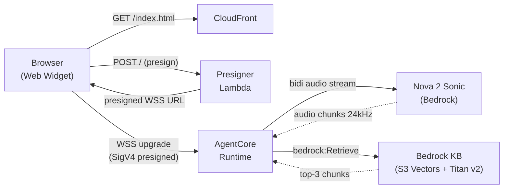
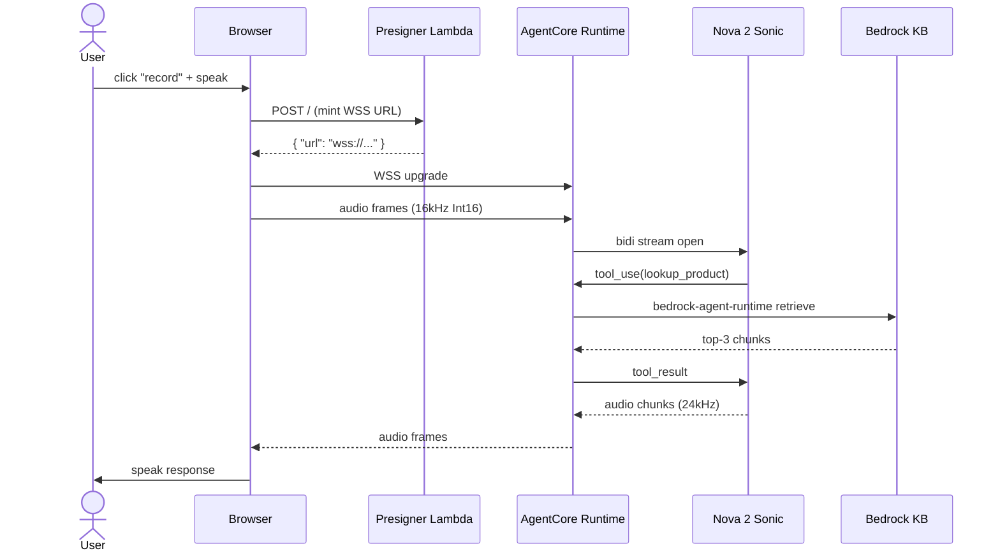

# Phase 5 Plan 01: Parity gate + config + Phần 1 Introduction Summary

DOC-12 parity gate (`bin/check-i18n-parity.sh` + deploy.yml pre-build wiring) plus DOC-01 Phần 1 Introduction (vi+en single-page chapter with Mermaid component + sequence diagrams) shipped in 5 atomic commits. Tree is parity-clean at vi=6, en=6 `_index.md`; submodule untouched; demo budget honored (zero AWS deploys).

## Operator decision (Task 3 — pre-resolved checkpoint)

**Selected option: `default`.** baseURL = `https://KenzyTran.github.io/hera/` written verbatim into `config.toml` line 1.

Rationale forwarded from orchestrator pre-resolved checkpoint:
- `git config user.name` returns `KenzyTran`.
- `git remote -v` returns no remote (no `origin` configured).
- Hugo workflow at `.github/workflows/deploy.yml:51` builds with `--baseURL "${{ steps.pages.outputs.base_url }}/"` so the build artifact uses the GitHub Pages auto-discovered URL regardless of the `config.toml` value. The config value is essentially a documentation field for local-build / preview scenarios.

No operator notes beyond the option selection itself; the pre-resolved checkpoint cleared this without pausing execution.

## What shipped

### Atomic commits (in commit order)

| # | Hash      | Commit subject                                                                       | Task |
| - | --------- | ------------------------------------------------------------------------------------ | ---- |
| 1 | `17ed9e8` | chore(05-01): purge FCJ template stubs + 1.1-prerequisites both langs (D-53)         | 5    |
| 2 | `596ab95` | feat(05-01): add bin/check-i18n-parity.sh DOC-12 gate                                | 1    |
| 3 | `427d663` | ci(05-01): wire parity gate into deploy.yml pre-build                                | 2    |
| 4 | `c2f30ad` | docs(05-01): replace config.toml placeholders with Hera values (D-52)                | 4    |
| 5 | `eaa4d47` | feat(05-01): publish Phan 1 Introduction (vi+en) with folded prereqs                 | 6    |

Final atomic commit (this SUMMARY + STATE/ROADMAP/REQUIREMENTS) lands separately as `docs(05-01): summary and state update`.

### 10 deletions (Task 5; commit 17ed9e8)

8 FCJ-template stub `_index.md` files (D-41 keeps Phần 2 single-page; D-40 renames Phần 3 sub-pages so `step-one` / `step-two` slugs no longer apply):

- `content/vi/2-preparation/2.1-create-vpc/_index.md`
- `content/vi/2-preparation/2.2-create-ec2/_index.md`
- `content/en/2-preparation/2.1-create-vpc/_index.md`
- `content/en/2-preparation/2.2-create-ec2/_index.md`
- `content/vi/3-hands-on/3.1-step-one/_index.md`
- `content/vi/3-hands-on/3.2-step-two/_index.md`
- `content/en/3-hands-on/3.1-step-one/_index.md`
- `content/en/3-hands-on/3.2-step-two/_index.md`

2 prerequisites stub files (D-53 Option A; content folded into Phần 1):

- `content/vi/1-introduction/1.1-prerequisites.md`
- `content/en/1-introduction/1.1-prerequisites.md`

Post-delete tree shape: vi=6, en=6 `_index.md` per side (root + 5 chapter indexes). `diff` of slug trees = empty (parity holds).

### Mermaid sources (verbatim — byte-identical between vi and en)

Component diagram (`## Kiến trúc tổng thể` / `## High-level architecture`):



Sequence diagram (`## Voice loop một-vòng` / `## Voice loop end-to-end`):



`diff <(awk '/^\`\`\`mermaid$/,/^\`\`\`$/' content/vi/1-introduction/_index.md) <(awk '/^\`\`\`mermaid$/,/^\`\`\`$/' content/en/1-introduction/_index.md)` returns empty output — confirms byte-identity (parity-safe per D-55).

### Bilingual-parity pitfall callout (D-51 #7) — verbatim

Vietnamese (`content/vi/1-introduction/_index.md`):

```markdown
{}
**Quy ước song ngữ vi/en (DOC-12):** mọi PR sửa workshop content phải commit vi+en cùng lúc.
CI chạy `bin/check-i18n-parity.sh` trước khi build Hugo — nếu `content/vi` và
`content/en` lệch số file `_index.md`, build fail. Quy ước này tránh trạng thái
"chương đã có tiếng Việt nhưng tiếng Anh chưa kịp dịch" trong production.

*Source: bin/check-i18n-parity.sh — Phase 5 Plan 05-01*
{}
```

English (`content/en/1-introduction/_index.md`):

```markdown
{}
**Bilingual parity (DOC-12):** every PR that edits workshop content must commit
vi+en together. CI runs `bin/check-i18n-parity.sh` before the Hugo build — if
`content/vi` and `content/en` diverge in `_index.md` count, the build fails.
This convention prevents a "Vietnamese-only / English-not-yet-translated"
state shipping to production.

*Source: bin/check-i18n-parity.sh — Phase 5 Plan 05-01*
{}
```

### Cost callout (D-53 Option A folded content) — verbatim

Vietnamese:

```markdown
{}
**Chi phí:** Workshop có thể phát sinh chi phí nhỏ (~$2-5 USD cho 2-giờ session). Nhớ chạy Phần 4 Cleanup để tear down về $0 ngay sau session.
{}
```

English:

```markdown
{}
**Cost:** This workshop may incur a small charge (~$2-5 USD for a 2-hour session). Run Phần 4 Cleanup right after the session to tear back down to $0.
{}
```

## Verification gates run

| Gate                                                                | Result                                                                                                  |
| ------------------------------------------------------------------- | ------------------------------------------------------------------------------------------------------- |
| `find content/vi -name "_index.md" -type f \| wc -l`                | 6                                                                                                       |
| `find content/en -name "_index.md" -type f \| wc -l`                | 6                                                                                                       |
| `bash bin/check-i18n-parity.sh` (final tree)                        | exit 0; "2/2 parity assertions passed"                                                                  |
| `bash bin/check-i18n-parity.sh` (synthetic mismatch injection)      | exit 1; "FAIL: file count mismatch (vi=7, en=6)" + slug diff                                            |
| `bash -n bin/check-i18n-parity.sh`                                  | exit 0 (syntax clean)                                                                                   |
| `python -c "import yaml; yaml.safe_load(open('.github/workflows/deploy.yml'))"` | YAML_OK (parseable)                                                                          |
| `grep -c "YOUR_GITHUB_USERNAME\|Workshop Title\|Workshop description\|Your Name" config.toml` | 0                                                                                |
| `grep -P '[\x{1F300}-\x{1F9FF}]' content/vi content/en bin/check-i18n-parity.sh .github/workflows/deploy.yml config.toml` | no match (exit 1) — no emojis anywhere |
| `git diff --submodule themes/hugo-theme-learn`                      | empty (submodule untouched)                                                                             |
| `diff <(awk '/^\`\`\`mermaid$/,/^\`\`\`$/' vi) <(awk '/^\`\`\`mermaid$/,/^\`\`\`$/' en)` | empty (Mermaid byte-identity holds)                                                |
| `wc -l content/vi/1-introduction/_index.md`                         | 116 (>= 70 substantive content)                                                                         |
| `wc -l content/en/1-introduction/_index.md`                         | 117 (>= 70 substantive content)                                                                         |

## Deviations from Plan

None. Plan executed exactly as written. The pre-resolved checkpoint for Task 3 (`default`) was honored without pausing.

The orchestrator-supplied STATE.md frontmatter (added before plan execution started) was preserved as-is; this plan only updated:
- `last_updated` timestamp to the post-execution time.
- `last_activity` to reflect plan completion.
- `completed_plans` from 14 → 15.
- `percent` from 78 → 83.

## Authentication Gates

None. Plan is documentation-only with zero AWS / Bedrock / network calls.

## Self-Check: PASSED

All claimed artifacts verified to exist:

- `bin/check-i18n-parity.sh` — FOUND (executable, syntax clean, 66 lines)
- `.github/workflows/deploy.yml` — FOUND (parity step at line 38, between Checkout @ 32 and Build with Hugo @ 45)
- `config.toml` — FOUND (six placeholder replacements applied; theme + multilingual + unsafe-renderer + themeVariant preserved)
- `content/vi/_index.md` — FOUND (Hera workshop overview; 31 lines)
- `content/en/_index.md` — FOUND (Hera workshop overview; 31 lines)
- `content/vi/1-introduction/_index.md` — FOUND (116 lines; 2 Mermaid blocks; 2 notice warnings; folded prereqs H2)
- `content/en/1-introduction/_index.md` — FOUND (117 lines; 2 Mermaid blocks; 2 notice warnings; folded prereqs H2)

All claimed commits verified to exist on `master`:

- `17ed9e8` — FOUND (Task 5: 10 deletions)
- `596ab95` — FOUND (Task 1: parity script)
- `427d663` — FOUND (Task 2: deploy.yml wire)
- `c2f30ad` — FOUND (Task 4: config.toml replacements)
- `eaa4d47` — FOUND (Task 6: Phần 1 vi+en + root indexes vi+en)
