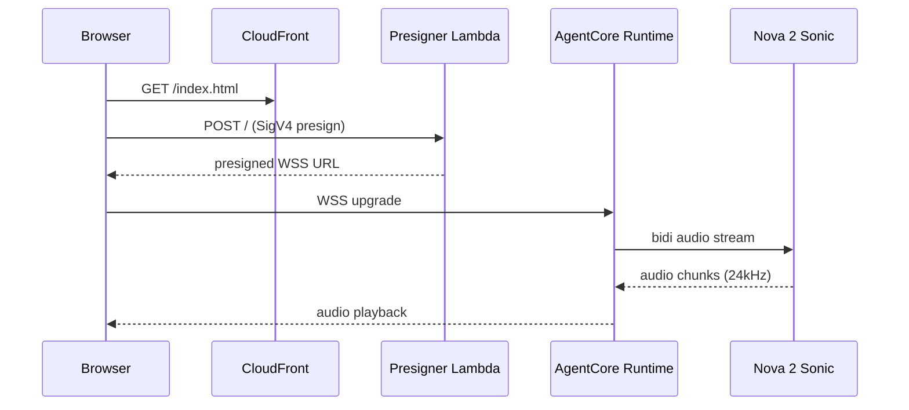

# Phase 5: Workshop Documentation (vi/en) - Pattern Map

**Mapped:** 2026-05-07
**Files analyzed:** ~32 (28 markdown + 1 bash + 1 config edit + 1 workflow edit + 0-1 i18n edit + 10-15 PNGs)
**Analogs found:** 32 / 32 (100%; every new file has at least one in-repo precedent)

## Source-of-truth read

- CONTEXT.md sections D-40, D-41, D-42, D-44..D-55, success_signals 1-5, code_context.
- No RESEARCH.md (skipped per orchestrator). All patterns sourced from in-repo analogs.

## File Classification

### Markdown content (Hugo, vi/en parity-locked, 28 files)

| New / Modified File | Role | Data Flow | Closest Analog | Match Quality |
|---|---|---|---|---|
| `content/vi/_index.md` (modified) | hugo-root-index | static-render | self (template stub) | exact |
| `content/en/_index.md` (modified) | hugo-root-index | static-render | self (template stub) | exact |
| `content/vi/1-introduction/_index.md` (modified) | hugo-chapter-index single-page | static-render | `content/vi/3-hands-on/_index.md` (chapter:true + pre + children) | exact |
| `content/en/1-introduction/_index.md` (modified) | hugo-chapter-index single-page | static-render | `content/en/3-hands-on/_index.md` | exact |
| `content/vi/2-preparation/_index.md` (modified) | hugo-chapter-index single-page | static-render | `content/vi/2-preparation/_index.md` (current stub — chapter:true) | exact |
| `content/en/2-preparation/_index.md` (modified) | hugo-chapter-index single-page | static-render | `content/en/2-preparation/_index.md` | exact |
| `content/vi/3-hands-on/_index.md` (modified) | hugo-chapter-parent-index | static-render | self (already correct shape) | exact |
| `content/en/3-hands-on/_index.md` (modified) | hugo-chapter-parent-index | static-render | self | exact |
| `content/vi/3-hands-on/3.1-knowledge-base/_index.md` (new) | hugo-subpage | static-render | `content/vi/3-hands-on/3.1-step-one/_index.md` (sub-page front-matter weight=1) | exact |
| `content/en/3-hands-on/3.1-knowledge-base/_index.md` (new) | hugo-subpage | static-render | `content/en/3-hands-on/3.1-step-one/_index.md` + `content/en/1-introduction/1.1-prerequisites.md` (notice usage) | exact |
| `content/vi/3-hands-on/3.2-pipecat-local/_index.md` (new) | hugo-subpage | static-render | same as 3.1 above | exact |
| `content/en/3-hands-on/3.2-pipecat-local/_index.md` (new) | hugo-subpage | static-render | same | exact |
| `content/vi/3-hands-on/3.3-deploy-agentcore/_index.md` (new) | hugo-subpage | static-render | same | exact |
| `content/en/3-hands-on/3.3-deploy-agentcore/_index.md` (new) | hugo-subpage | static-render | same | exact |
| `content/vi/3-hands-on/3.4-web-widget/_index.md` (new) | hugo-subpage | static-render | same | exact |
| `content/en/3-hands-on/3.4-web-widget/_index.md` (new) | hugo-subpage | static-render | same | exact |
| `content/vi/3-hands-on/3.5-observability/_index.md` (new) | hugo-subpage | static-render | same | exact |
| `content/en/3-hands-on/3.5-observability/_index.md` (new) | hugo-subpage | static-render | same | exact |
| `content/vi/4-cleanup/_index.md` (modified) | hugo-chapter-index single-page | static-render | `content/vi/4-cleanup/_index.md` (current stub — already has notice) | exact |
| `content/en/4-cleanup/_index.md` (modified) | hugo-chapter-index single-page | static-render | same | exact |
| `content/vi/5-summary/_index.md` (modified) | hugo-chapter-index single-page | static-render | `content/vi/5-summary/_index.md` (current stub) | exact |
| `content/en/5-summary/_index.md` (modified) | hugo-chapter-index single-page | static-render | same | exact |

Plus optional removal/repurpose of `content/en/1-introduction/1.1-prerequisites.md` per D-53.

Note: existing template stubs `content/{vi,en}/2-preparation/2.1-create-vpc/`, `2.2-create-ec2/`, `3-hands-on/3.1-step-one/`, `3.2-step-two/` must be deleted (4 stubs * 2 langs = 8 files). They are template scaffolding that does not match the Phase 5 chapter plan — Phần 2 stays single-page (D-41), Phần 3 sub-page slugs are renamed (D-40).

### Non-markdown new/modified files (4)

| New / Modified File | Role | Data Flow | Closest Analog | Match Quality |
|---|---|---|---|---|
| `bin/check-i18n-parity.sh` (new) | bash script | file-IO + exit-code gate | `bin/cleanup-verify.sh` (PASS/FAIL counter pattern) + `bin/verify-kb.sh` (preflight + usage) | exact role, partial flow |
| `config.toml` (modified) | hugo-config | static-config | self (current placeholders) | exact |
| `.github/workflows/deploy.yml` (modified) | CI workflow | event-driven | self (current Hugo build job) | exact |
| `i18n/{vi,en}.toml` (optional, modified) | hugo-theme-i18n | static-config | self (existing keys) | exact |
| `static/images/<chapter>/*.png` (new, 10-15 files) | static asset | binary | `static/images/cloud-clubs-logo.webp` | role-match |

## Pattern Assignments

---

### `content/{vi,en}/<chapter>/_index.md` — chapter-index, single-page Phần (1, 2, 4, 5)

**Analog (vi):** `content/vi/3-hands-on/_index.md` (current state).
**Analog (en):** `content/en/3-hands-on/_index.md` (current state).
**What it teaches:** front-matter shape for a top-level chapter index in `hugo-theme-learn` — `weight`, `chapter: true`, `pre: "<b>N. </b>"`, the H3 chapter-tag heading, the H1 chapter title, and the `{}` shortcode (only used by Phần 3 which has sub-pages; Phần 1/2/4/5 omit `children` and use the body for full-page content).

**Front-matter pattern** (`content/vi/3-hands-on/_index.md` lines 1-7, vi side):

```markdown
---
title: "Thực hành"
date: 2025-01-01
weight: 3
chapter: true
pre: "<b>3. </b>"
---
```

**Front-matter pattern** (`content/en/3-hands-on/_index.md` lines 1-7, en side):

```markdown
---
title: "Hands-on"
date: 2025-01-01
weight: 3
chapter: true
pre: "<b>3. </b>"
---
```

**Body pattern (with sub-pages, Phần 3 only)** (`content/vi/3-hands-on/_index.md` lines 8-16):

```markdown
### Thực hành

# Các bước thực hành

Trong phần này, chúng ta sẽ thực hiện các bước chính của workshop.

{}
```

**Body pattern (single-page, Phần 1/2/4/5)** — derived from `content/vi/4-cleanup/_index.md` lines 8-23 (drop `{}`, write the full chapter inline; `notice` shortcodes go inline):

```markdown
### Dọn dẹp tài nguyên

# Clean up

[full chapter prose, code blocks, notice callouts, screenshots]

{}
Hãy đảm bảo bạn đã xóa tất cả tài nguyên để tránh phát sinh chi phí ngoài ý muốn.
{}
```

**Rules for executor:**
- Keep `weight` in 1..5 matching chapter number, `pre: "<b>N. </b>"` matching.
- Use Vietnamese in `title` field for vi files; English in en files.
- vi-first authoring (D-49) — write vi `_index.md` first, then translate to en in same plan + same commit so file-count parity (D-50) never trips mid-PR.

---

### `content/{vi,en}/3-hands-on/3.X-<slug>/_index.md` — sub-page (Phần 3.1..3.5)

**Analog (sub-page front-matter):** `content/en/1-introduction/1.1-prerequisites.md` lines 1-5 + `content/vi/3-hands-on/3.1-step-one/_index.md` lines 1-5.
**Analog (notice usage):** `content/en/1-introduction/1.1-prerequisites.md` lines 26-28.
**What it teaches:** sub-pages are NOT chapters (no `chapter: true`, no `pre`). Use H2 (`## `) for the lead heading, H3 (`### `) for sub-sections, fenced code blocks for snippets, `{}` for pitfall callouts (D-51).

**Front-matter pattern** (sub-page; `content/en/1-introduction/1.1-prerequisites.md` lines 1-5):

```markdown
---
title: "1.1 Prerequisites"
date: 2025-01-01
weight: 1
---
```

For Phần 3 sub-pages: title in vi `"3.1 Knowledge Base"`, en `"3.1 Knowledge Base"`; weight = 1..5 matching 3.1..3.5 ordinal so theme sidebar + next/prev nav auto-orders.

**Body pattern (full sub-page; `content/en/1-introduction/1.1-prerequisites.md` lines 7-29 — distilled):**

```markdown
## Prerequisites

### AWS Account

- You need an AWS Account. If you don't have one, [create one here](https://aws.amazon.com/free/).
- Use an IAM user with Administrator access (do not use root account).

### Tools

| Tool | Description |
|------|-------------|
| AWS CLI | Command line interface |

{}
**Cost:** This workshop may incur small charges. Remember to clean up resources after completion.
{}
```

**Code-block + Source-footer pattern (D-42, NEW for Phase 5 — no in-repo precedent yet, but it's a tiny extension of fenced-bash blocks which already exist throughout `RUNBOOK.md` and `content/vi/3-hands-on/3.1-step-one/_index.md` lines 17-20):**

```markdown
```bash
aws bedrock-agent get-knowledge-base \
  --knowledge-base-id BKXE19AH89 \
  --region ap-northeast-1
```

*Source: bin/verify-kb.sh — Phase 1 Plan 01-04*
```

The italic `*Source: <repo-relative-path> — Phase X Plan XX-XX*` line lives immediately under each fenced block per D-42/D-43. No GitHub permalink, no SHA. Repo-relative path so learners can `cat` in their cloned tree.

**Notice shortcode pattern (D-51, pitfall callouts):**

Theme variants: `notice info`, `notice warning`, `notice tip`, `notice note`. From `content/en/1-introduction/1.1-prerequisites.md` line 26 + `content/vi/4-cleanup/_index.md` line 21:

```markdown
{}
**8-min Sonic stream cap:** Amazon Nova 2 Sonic terminates a single bidirectional
stream after ~8 minutes. Pipecat's `SessionContinuationParams` re-issues a new
stream automatically when this fires. If your voice session goes silent at the
8-minute mark, check `agent/hera_agent/session.py` — Phase 2 Plan 02-01.
{}
```

Place inline at the moment the learner is about to hit the pitfall, not in a separate FAQ chapter (D-51).

**Mermaid shortcode pattern (D-55, Phần 1 architecture diagram):**

`hugo-theme-learn` supports Mermaid via fenced ` ```mermaid ` (Goldmark + theme JS). No in-repo example yet but theme docs confirm. Pattern:

````markdown

````

ASCII fallback (if theme Mermaid renders blank) — same source in vi + en, only labels translate. Both vi and en files use the same Mermaid block since identifiers are language-agnostic; only the surrounding prose translates.

**Image reference pattern (D-44 + D-45):**

From `content/vi/3-hands-on/3.1-step-one/_index.md` line 22:

```markdown

```

For Phase 5: `static/images/<chapter-slug>/<filename>.png` becomes `/images/<chapter-slug>/<filename>.png` (Hugo strips `static/` prefix). Filenames use the screenshot inventory from D-44 — e.g., `console-bedrock-model-access.png`, `cloudwatch-dashboard-hera-prod.png`, `cleanup-verify-output.png`.

**Critical no-go (CLAUDE.md mandate):** zero emojis in any chapter content, code block, or notice. The existing template stubs are clean — preserve that.

---

### `content/{vi,en}/_index.md` — root index (modified)

**Analog:** self (`content/vi/_index.md` + `content/en/_index.md`, current state).
**What it teaches:** root index uses `weight: 0`, no `chapter: true`, no `pre`. Body has table + `{}` to render the 5-chapter top-level list.

**Front-matter pattern** (`content/vi/_index.md` lines 1-5):

```markdown
---
title: "Workshop Title"
date: 2025-01-01
weight: 0
---
```

**Body pattern** (`content/vi/_index.md` lines 7-26):

```markdown
# Workshop Title

### Giới thiệu

Mô tả ngắn gọn về workshop của bạn.

| Thông tin | Chi tiết |
|-----------|----------|
| Thời gian | ~60 phút |
| Cấp độ | Beginner / Intermediate / Advanced |
| Chi phí | Free Tier eligible |

### Yêu cầu

- AWS Account
- Kiến thức cơ bản về AWS

### Nội dung

{}
```

**Phase 5 fills:** `title` becomes "Hera — AWS Voice Agent Workshop" (vi: "Hera — Workshop Voice Agent trên AWS"). Duration ~3-4h hands-on. Level: Intermediate. Cost: ~$2-5 USD per session if cleaned up (D-54). Replace placeholder rows with real content; keep `{}` shortcode unchanged.

---

### `bin/check-i18n-parity.sh` (new)

**Analog (PASS/FAIL accumulator + read-only checks):** `bin/cleanup-verify.sh`.
**Analog (preflight + usage block + region default):** `bin/verify-kb.sh`.
**What it teaches:** the existing bash script idiom for this repo — `set -euo pipefail`, `command -v` preflight (no install attempts), repo-relative path computation via `REPO_ROOT="$(cd "$(dirname "$0")/.." && pwd)"`, exit 0 on success / 1 on failure with hint block, exit 2 on missing tool, leading docstring comment block.

**Header / docstring pattern** (`bin/cleanup-verify.sh` lines 1-17):

```bash
#!/usr/bin/env bash
# bin/check-i18n-parity.sh - Phase 5 DOC-12 parity gate (D-50).
# Asserts content/vi and content/en have matching _index.md file structure.
# Read-only: never writes any file. Wired into .github/workflows/deploy.yml as
# a pre-build step.
#
# Usage:  bash bin/check-i18n-parity.sh
# Reads:  content/vi/**/_index.md, content/en/**/_index.md
# Effect: counts and diffs slugs; exits 0 on parity, 1 with a diff list on mismatch.

set -euo pipefail
```

**Preflight pattern** (`bin/verify-kb.sh` lines 33-35) — minimal, only check tools actually used:

```bash
# --- preflight: required tools ---
command -v find >/dev/null 2>&1 || { echo "ERROR: find not found on PATH" >&2; exit 2; }
command -v sort >/dev/null 2>&1 || { echo "ERROR: sort not found on PATH" >&2; exit 2; }
command -v diff >/dev/null 2>&1 || { echo "ERROR: diff not found on PATH" >&2; exit 2; }
```

**Counter + report + exit-with-hints pattern** (`bin/cleanup-verify.sh` lines 30-31, 170-194):

```bash
PASS_COUNT=0
FAIL_COUNT=0

# ... checks ...

TOTAL=$((PASS_COUNT + FAIL_COUNT))
echo "----------------------------------------"
echo "check-i18n-parity: ${PASS_COUNT}/${TOTAL} parity assertions passed"

if [[ "${FAIL_COUNT}" -gt 0 ]]; then
  echo "" >&2
  echo "FAIL: ${FAIL_COUNT} parity violation(s)." >&2
  echo "" >&2
  echo "Hints:" >&2
  echo "  - Did you author vi+en in the same commit (D-49)?" >&2
  echo "  - Slug missing in one tree? Add the matching _index.md." >&2
  exit 1
fi

echo "OK: vi/en _index.md tree parity"
exit 0
```

**Specific check shape (D-50 minimal file-count parity):**

Two checks in this script:
1. `find content/vi -name _index.md | wc -l` equals `find content/en -name _index.md | wc -l`.
2. For each `content/vi/<path>/_index.md`, `content/en/<path>/_index.md` exists; for each `content/en/<path>/_index.md`, `content/vi/<path>/_index.md` exists. (Bidirectional — catch slug rename in either side.)

Reuse `_check_count_zero` / `_check_gone` shape from `bin/cleanup-verify.sh` lines 39-70 only if natural; this script is simpler (2 logical checks vs 19) so a flat implementation is fine.

**No region default needed** (this script is local-only; no AWS calls). Drop `HERA_REGION` boilerplate.

**Critical:** no emojis, English error messages (`bin/cleanup-verify.sh` precedent — even script comments stay English; vi only lives in workshop content per CLAUDE.md).

---

### `config.toml` (modified per D-52)

**Analog:** self.
**What it teaches:** the multilingual config is correct already (`defaultContentLanguage = "vi"`, `defaultContentLanguageInSubdir = true`, `[languages.vi]` + `[languages.en]` blocks, `themeVariant = "workshop"`, `[outputs] home = ["HTML", "RSS", "JSON"]`, `[markup.goldmark.renderer] unsafe = true`). Only placeholders need replacement; structure stays.

**Current state** (`config.toml` lines 1-3, 13-14, 19-23, 29):

```toml
baseURL = "https://YOUR_GITHUB_USERNAME.github.io/YOUR_REPO_NAME/"
title = "Workshop Title"
theme = "hugo-theme-learn"

# ... in [languages.vi]:
    title = "Workshop Title"
# ... in [languages.en]:
    title = "Workshop Title"

[params]
  description = "Workshop description"
  author = "Your Name"
  showVisitedLinks = false
  ...
  themeVariant = "workshop"
```

**D-52 replacement target:**

```toml
baseURL = "https://KenzyTran.github.io/hera/"
title = "Hera — AWS Voice Agent Workshop"
theme = "hugo-theme-learn"

# ... in [languages.vi]:
    title = "Hera — Workshop Voice Agent trên AWS"
# ... in [languages.en]:
    title = "Hera — AWS Voice Agent Workshop"

[params]
  description = "FCJ workshop deploying a bilingual voice agent on Amazon Bedrock AgentCore Runtime + Nova 2 Sonic."
  author = "AWS Cloud Clubs Vietnam"
  showVisitedLinks = false
  ...
  themeVariant = "workshop"
```

**Note on `baseURL`:** repo has no `origin` remote configured (only `master` branch tracked). Planner reads from project memory + CONTEXT D-52 specifics — KenzyTran is git user, GitHub Pages URL pattern `https://<user>.github.io/<repo>/`. Verify with operator at planning time before commit.

**What stays unchanged:**
- `theme = "hugo-theme-learn"`
- `defaultContentLanguage = "vi"`
- `defaultContentLanguageInSubdir = true`
- `[outputs] home = ["HTML", "RSS", "JSON"]`
- `[markup.goldmark.renderer] unsafe = true` (required for `notice` + `mermaid` shortcodes to emit raw HTML)
- `[languages.*]` block keys (`languageName`, `contentDir`, `weight`, `languageCode`)
- `[params]` keys list (`showVisitedLinks`, `disableBreadcrumb`, `disableNextPrev`, `disableLandingPageButton`, `themeVariant`)

---

### `.github/workflows/deploy.yml` (modified per D-50)

**Analog:** self.
**What it teaches:** Hugo install + checkout + configure-pages + Hugo build + upload-artifact + deploy-pages two-job pipeline, GH-Pages permissions block, Hugo extended 0.139.4. The parity gate is a single new step inserted before `Build with Hugo`.

**Current build job structure** (`.github/workflows/deploy.yml` lines 22-56):

```yaml
jobs:
  build:
    runs-on: ubuntu-latest
    env:
      HUGO_VERSION: 0.139.4
    steps:
      - name: Install Hugo CLI
        run: |
          wget -O ${{ runner.temp }}/hugo.deb ...
          && sudo dpkg -i ${{ runner.temp }}/hugo.deb

      - name: Checkout
        uses: actions/checkout@v4
        with:
          submodules: recursive
          fetch-depth: 0

      - name: Setup Pages
        id: pages
        uses: actions/configure-pages@v5

      - name: Build with Hugo
        env:
          HUGO_CACHEDIR: ${{ runner.temp }}/hugo_cache
          HUGO_ENVIRONMENT: production
          TZ: Asia/Ho_Chi_Minh
        run: |
          hugo \
            --gc \
            --minify \
            --baseURL "${{ steps.pages.outputs.base_url }}/"

      - name: Upload artifact
        uses: actions/upload-pages-artifact@v3
        with:
          path: ./public
```

**D-50 insertion** (new step between `Checkout` and `Setup Pages`, or between `Setup Pages` and `Build with Hugo` — planner decides; either works since the script does no AWS calls and reads only the working tree):

```yaml
      - name: Check vi/en parity (DOC-12)
        run: bash bin/check-i18n-parity.sh
```

That's the entire `deploy.yml` edit. No new job, no matrix, no environment changes. The shell default `bash` is already set at file-level (`defaults: run: shell: bash` lines 17-19) so no extra `shell:` key needed.

---

### `i18n/{vi,en}.toml` (optional, modified)

**Analog:** self.
**What it teaches:** existing keys cover theme UI strings (`Search-placeholder`, `note`, `info`, `tip`, `warning`, `Edit-this-page`, etc.). Format is TOML with `[Key]\nother = "string"` blocks.

**Pattern to replicate IF a new UI string is added** (`i18n/vi.toml` lines 1-2):

```toml
[Search-placeholder]
other = "Tìm kiếm..."
```

Phase 5 most likely needs zero additions — chapters use only existing built-in shortcodes (`notice`, `mermaid`, `children`) whose UI labels already have keys. Planner skips this file unless a chapter introduces a custom UI element (which D-51 + D-55 explicitly avoid).

---

### `static/images/<chapter>/*.png` (10-15 new binary files)

**Analog:** `static/images/cloud-clubs-logo.webp` (existing binary asset placement) + `static/images/.gitkeep`.
**What it teaches:** Hugo serves `static/` at the site root. `static/images/foo.png` is referenced as `/images/foo.png` in markdown.

**Path convention (D-45):**

```
static/images/3.3-deploy-agentcore/console-bedrock-model-access.png
static/images/3.3-deploy-agentcore/service-quotas-agentcore-concurrency.png
static/images/3.4-web-widget/widget-idle-state.png
static/images/3.5-observability/billing-alerts-toggle.png
static/images/3.5-observability/cloudwatch-dashboard-hera-prod.png
static/images/4-cleanup/cleanup-verify-output.png
```

(Filenames are illustrative — planner picks the final 10-15 from D-44 inventory.)

**Markdown reference pattern** (precedent from `content/vi/3-hands-on/3.1-step-one/_index.md` line 22):

```markdown

```

**Annotation policy (D-45):** annotations (red box, arrow, text label) baked into the PNG at capture time; no client-side overlay, no Hugo shortcode for annotations. Tool-agnostic — any annotated PNG works.

**Critical:** no emojis in alt-text or captions either. Alt-text is meaningful description, not "fancy diagram" or similar fluff (a11y + parity).

---

## Shared Patterns

### Pattern S1 — vi-first authoring + same-commit en translation (D-49)

**Source:** project memory + D-49 + git history (`docs(05): capture phase context` was a single-commit doc-only change matching this rhythm).
**Apply to:** every chapter plan in Phase 5. Each plan PR commits BOTH `content/vi/<path>/_index.md` AND `content/en/<path>/_index.md` together. Parity check (`bin/check-i18n-parity.sh`) never fails on a half-shipped chapter because vi+en land atomically.

### Pattern S2 — Conventional commit scoped to plan id

**Source:** `git log --oneline -20` recent commits — `feat(04-02): wire observability module`, `docs(04-03): RUNBOOK Phase 4 cleanup quy trinh`, `docs(05): capture phase context`.
**Apply to:** every Phase 5 commit. Format `<type>(<plan-id>): <imperative summary>` where `<plan-id>` is `05-XX` and `<type>` is `feat` (new files), `docs` (RUNBOOK / planning artefacts only), `chore` (config edits). Workshop content commits use `feat(05-XX): publish Phần X (vi+en)` since they ship learner-facing pages.

### Pattern S3 — Source-footer reference for inline snippets (D-42)

**Source:** D-42 + `content/vi/3-hands-on/3.1-step-one/_index.md` lines 17-20 (existing fenced-bash precedent) + RUNBOOK precedent of footnote-style attribution to `bin/*.sh`.
**Apply to:** every fenced code block in `content/{vi,en}/3-hands-on/**/*.md` and `content/{vi,en}/4-cleanup/_index.md`. Format:

````markdown
```bash
<verbatim snippet>
```

*Source: <repo-relative-path> — Phase X Plan XX-XX*
````

Path is repo-relative (no `C:\` no URL no SHA per D-43). Phase + plan id match the commit that introduced the snippet. Planner can `grep '^\*Source:'` content tree to audit drift later.

### Pattern S4 — `notice` shortcode for pitfalls at trigger point (D-51)

**Source:** `content/en/1-introduction/1.1-prerequisites.md` lines 26-28 + `content/vi/4-cleanup/_index.md` lines 21-23 + theme docs.
**Apply to:** all 8 D-51 pitfalls placed at chapter location specified in CONTEXT. Use `notice warning` for "watch out" pitfalls; `notice info` for "FYI" advisory; `notice tip` for shortcuts. Inline at the moment learner is about to trigger the issue, not in a separate FAQ.

### Pattern S5 — Region default `ap-northeast-1` everywhere (D-47)

**Source:** D-47 + `bin/cleanup-verify.sh` line 25 (`REGION="${HERA_REGION:-ap-northeast-1}"`) + `bin/verify-kb.sh` line 38 + `bin/push-image.sh` line 45 + `RUNBOOK.md` line 7.
**Apply to:** every CLI snippet, every screenshot region selector, every Terraform variable mention in chapters. Single one-liner in Phần 1 architecture page mentions us-east-1 / us-west-2 / eu-north-1 alternatives but explicitly says snippets default to ap-northeast-1.

### Pattern S6 — No emojis (CLAUDE.md mandate)

**Source:** `CLAUDE.md` "no emojis in code, logs, or print statements" + AGENTS.md "Never use emojis in code or in print statements or logging".
**Apply to:** all 28 markdown content files, all bash scripts, all alt-text, all notice bodies, all Mermaid labels. The existing template stubs are clean — preserve. Greppable rule: `grep -P '[\x{1F300}-\x{1F9FF}]' content/` returns nothing.

### Pattern S7 — Bash script idioms (`set -euo pipefail` + preflight + repo-root resolution)

**Source:** `bin/cleanup-verify.sh` lines 18, 21-22, 30-31 + `bin/push-image.sh` lines 19, 22-33, 42 + `bin/verify-kb.sh` lines 7, 33-35, 38.
**Apply to:** `bin/check-i18n-parity.sh`. Mandatory: `set -euo pipefail` at top; `command -v <tool>` preflight with `exit 2` on missing tool; PASS/FAIL counters; `exit 1` with hint block on failure; `exit 0` with single OK line on success.

### Pattern S8 — Phase / plan attribution in script header docstring

**Source:** `bin/cleanup-verify.sh` lines 1-17 + `bin/push-image.sh` lines 1-17 + `bin/smoke-deploy.sh` lines 1-15.
**Apply to:** `bin/check-i18n-parity.sh` header docstring — must cite `Phase 5 DOC-12 (D-50)` so future readers can trace the requirement.

---

## No Analog Found

Every Phase 5 file has at least a partial in-repo analog. Two patterns are NEW but trivially-derived extensions of existing precedent:

| Pattern | Closest precedent | Why "new" but safe |
|---|---|---|
| `*Source: <path> — Phase X Plan XX-XX*` italic footer under fenced blocks | RUNBOOK paste-style code blocks; existing template fenced-bash in `content/vi/3-hands-on/3.1-step-one/_index.md` line 17-20 | D-42 newly mandates the footer; the line is plain Markdown italic, no shortcode, no theme dependency. Zero risk. |
| ` ```mermaid ` fenced block for D-55 architecture diagram | None in-repo (no Mermaid block exists yet) | `hugo-theme-learn` supports it via Goldmark passthrough + theme JS (theme docs confirmed). `unsafe = true` already set in `config.toml` line 37. Fallback: ASCII boxes-and-arrows in fenced ` ``` ` if theme renders blank — both vi and en use same ASCII source so parity-safe. |

No file in Phase 5 needs a from-scratch invented pattern.

---

## Analog Search Scope

**Directories scanned:**
- `content/{vi,en}/**/_index.md` (10 files; 4 chapter indexes per lang + root + 2-prep stubs + 3-hands-on stubs + 1.1-prerequisites)
- `bin/*.sh` (8 scripts; closest analogs `cleanup-verify.sh`, `verify-kb.sh`, `push-image.sh`, `smoke-deploy.sh`)
- `config.toml`, `i18n/{vi,en}.toml`, `.github/workflows/deploy.yml`
- `RUNBOOK.md` (sections mapped: Pre-flight + First deploy + First sync + Verify -> Phần 3.1; Local agent setup + First voice test -> Phần 3.2; Phase 3 AgentCore deploy -> Phần 3.3; Phase 4 Protocol-bridge + Observability -> Phần 3.4 + 3.5; Phase 4 Cleanup quy trinh -> Phần 4)
- `git log --oneline -20` (commit-message style precedent)
- `static/images/` (binary asset placement)

**Files read end-to-end:**
- `content/vi/_index.md`, `content/en/_index.md`
- `content/vi/3-hands-on/_index.md`, `content/en/3-hands-on/_index.md`
- `content/vi/1-introduction/_index.md`, `content/en/1-introduction/_index.md`
- `content/vi/2-preparation/_index.md`, `content/vi/4-cleanup/_index.md`, `content/vi/5-summary/_index.md`
- `content/vi/2-preparation/2.1-create-vpc/_index.md`, `content/vi/3-hands-on/3.1-step-one/_index.md`, `content/en/3-hands-on/3.1-step-one/_index.md`
- `content/en/1-introduction/1.1-prerequisites.md`
- `bin/cleanup-verify.sh`, `bin/verify-kb.sh`, `bin/push-image.sh`, `bin/smoke-deploy.sh` (header only)
- `i18n/vi.toml`, `i18n/en.toml`
- `config.toml`, `.github/workflows/deploy.yml`

**Files read via targeted offset:**
- `RUNBOOK.md` header (lines 1-80)
- `RUNBOOK.md` Phase 4 Observability walkthrough (lines 566-655)
- `RUNBOOK.md` Phase 4 Cleanup quy trinh (lines 664-753)

**Files NOT read (out of scope for pattern extraction):**
- `themes/hugo-theme-learn/` git submodule (locked; do not touch per CONTEXT canonical_refs)
- `agent/`, `infra/`, `cdk/`, `frontend/` source trees (these are SOURCES for snippets, not pattern analogs for the new files; planner pulls snippets at execution time per D-42)
- `.planning/` recursive (CONTEXT.md and STATE.md already in context)

**Pattern extraction date:** 2026-05-07
