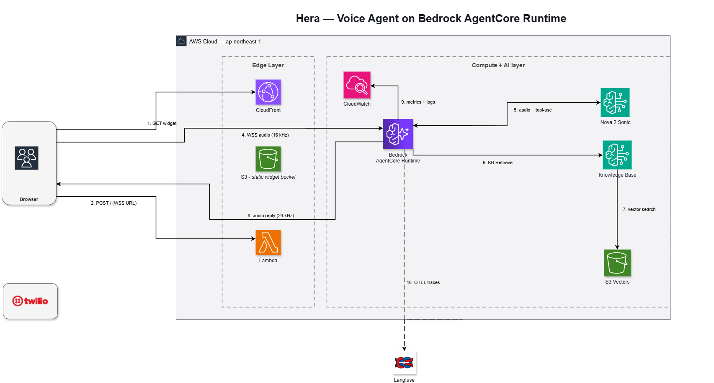

# Hera

A voice-first Apple Store assistant. Người dùng nói qua microphone trên trình duyệt → agent trả lời bằng giọng nói tự nhiên, có **RAG** lấy spec/giá/tồn kho sản phẩm Apple từ knowledge base nhỏ trên S3 Vectors.

Project gồm 2 mặt:
- **Demo voice agent** chạy được end-to-end trên AWS Bedrock AgentCore Runtime.
- **Workshop song ngữ vi/en** (5 chương) hướng dẫn build lại từ đầu.

---

## Highlights

- **Speech-to-speech native** — Amazon Nova 2 Sonic xử lý cả ASR + LLM + TTS trong một bidirectional stream (không cần cascade STT → LLM → TTS riêng).
- **Voice tool calling** — agent gọi `lookup_product` khi user hỏi về Apple product, tool query Bedrock Knowledge Base → S3 Vectors → top-3 chunks → Sonic compose câu trả lời.
- **Serverless deploy** — AgentCore Runtime (managed microVM, $0 khi idle) + CloudFront/S3 widget + Lambda presigner. Không cần ECS/EKS/EC2.
- **Browser-only client** — vanilla JS + AudioWorklet 16 kHz PCM upstream, 24 kHz playback downstream, SigV4 presigned WebSocket (không cần SDK trong browser).
- **Bilingual workshop** — vi + en mirrored 1:1, parity enforce bằng `bin/check-i18n-parity.sh`.
- **Optional Langfuse tracing** — waterfall trace mỗi voice session (hera-voice-session → lookup_product → kb_retrieve) trên cloud Langfuse free tier; tự skip khi không set key.

---

## Architecture



**Data plane (mỗi voice turn):**

1. Browser xin presigned WebSocket URL từ Lambda presigner (SigV4 5-min TTL).
2. Browser mở WebSocket trực tiếp tới AgentCore Runtime `/ws`.
3. Pipecat container nhận mic PCM, gửi vào Sonic bidi stream.
4. Sonic transcribe → quyết định gọi `lookup_product` → Pipecat dispatch tool → Bedrock KB Retrieve → S3 Vectors semantic search → trả chunks.
5. Sonic compose response (audio) → Pipecat stream về browser → AudioContext playback.

**Stack chốt:**

| Layer | Service / library |
|---|---|
| Speech-to-speech model | Amazon Nova 2 Sonic (`amazon.nova-2-sonic-v1:0`) |
| Voice orchestration | Pipecat 1.2.1 (`aws-nova-sonic` + `silero` + `websocket` extras) |
| Runtime | Amazon Bedrock AgentCore Runtime (HTTP protocol, `/ws` endpoint) |
| Knowledge base | Bedrock Knowledge Base + S3 Vectors + Titan v2 embeddings |
| Widget hosting | CloudFront + S3 (OAC) |
| Auth bridge | Lambda Function URL (SigV4 presigner) |
| IaC | Terraform `~> 6.27` (everything except runtime) + CDK (runtime only) |
| Observability | CloudWatch Logs + Dashboard + alarms; X-Ray spans; optional Langfuse |

---

## Quick start (local)

Chạy agent + widget local bằng `docker compose` (không cần deploy lên AWS):

```bash
# Cần: docker, uv, AWS creds với quyền bedrock-runtime + bedrock-agent-runtime
export AWS_PROFILE=<your-profile>   # hoặc set AWS_ACCESS_KEY_ID / AWS_SECRET_ACCESS_KEY
export HERA_KB_ID=<your-kb-id>      # nếu chưa có KB, build qua bước "Deploy production" trước

docker compose up --build
# Mở http://localhost:8000/ → click record → hỏi "Do you have MacBook Pro?"
```

Container agent ở `localhost:8080`, widget ở `localhost:8000`. Mic → Sonic → KB → reply audio chạy y hệt production.

---

## Workshop

5 chương song ngữ vi/en theo format [First Cloud Journey](https://cloudjourney.awsstudygroup.com/), build bằng `hugo-theme-learn`:

| Chương | Nội dung |
|---|---|
| [`1-introduction`](content/vi/1-introduction/) | Bối cảnh, kiến trúc, conventions |
| [`2-preparation`](content/vi/2-preparation/) | AWS account setup, install tools (uv, terraform, cdk, docker) |
| [`3-hands-on`](content/vi/3-hands-on/) | 5 sections: KB → Pipecat local → AgentCore deploy → widget → observability (optional Langfuse) |
| [`4-cleanup`](content/vi/4-cleanup/) | `cdk destroy` + `terraform destroy` + `bin/cleanup-verify.sh` (20 read-only checks) |
| [`5-summary`](content/vi/5-summary/) | Recap + extension ideas |

Workshop auto-publish lên GitHub Pages khi push `master` (GitHub Actions workflow ở [`.github/workflows/deploy.yml`](.github/workflows/deploy.yml)). CI enforce parity vi/en bằng `bin/check-i18n-parity.sh` (DOC-12) trước khi build.

---

## Deploy production

```bash
# 1. Terraform: KB + S3 Vectors + IAM + ECR + CloudFront + Lambda + observability
cd infra/envs/prod && terraform apply

# 2. Build + push agent image to ECR (multi-arch arm64+amd64)
cd ../../.. && bash bin/push-image.sh

# 3. CDK deploy AgentCore Runtime (binds to TF-managed image + role)
cd infra/cdk && uv run cdk deploy hera-agentcore --context image_tag=<short-git-sha>

# 4. (Tuỳ chọn) Bật Langfuse tracing
source .env.langfuse    # gitignored; tạo manual với keys từ cloud.langfuse.com
aws bedrock-agentcore-control update-agent-runtime \
  --agent-runtime-id <runtime-id> --region ap-northeast-1 \
  ... \
  --environment-variables "..,LANGFUSE_PUBLIC_KEY=$LANGFUSE_PUBLIC_KEY,LANGFUSE_SECRET_KEY=$LANGFUSE_SECRET_KEY,LANGFUSE_HOST=$LANGFUSE_HOST"

# 5. Build + push widget tới S3 + invalidate CloudFront
cd ../.. && bash bin/build-widget.sh
```

Chi tiết observability + cách rotate secrets: [`docs/OBSERVABILITY.md`](docs/OBSERVABILITY.md).

---

## Cost

| Resource | Idle | 1 hour active demo |
|---|---|---|
| AgentCore Runtime | $0 | ~$0.10/h khi có session |
| Bedrock Nova 2 Sonic | $0 | ~$0.30 per 10 min conversation |
| Bedrock KB Retrieve | $0 | ~$0.001 per query (Titan embed + S3 Vectors search) |
| CloudFront + S3 widget | ~$0 | ~$0 (low traffic) |
| Lambda presigner | $0 | $0 (well within free tier) |
| S3 Vectors storage | ~$0 (KB nhỏ <10 MB) | ~$0 |

Total burst test: < $1/h. Idle overnight: < $0.05.

Có CloudWatch billing alarm `hera-billing-prod` (`us-east-1`) bắn khi cost > $5/ngày để tránh runaway.

---

## Destroy (zero cost)

```bash
cd infra/cdk && uv run cdk destroy hera-agentcore --force
aws s3 rm s3://hera-kb-source-prod --recursive
aws s3 rm s3://hera-widget-prod --recursive
aws ecr batch-delete-image --repository-name hera-agent \
  --image-ids "$(aws ecr list-images --repository-name hera-agent --query 'imageIds[*]' --output json)"
cd ../envs/prod && terraform destroy
cd ../../.. && bash bin/cleanup-verify.sh    # phải PASS 20/20
```

Verify $0 cost sau 24h bằng paste-line trong [`docs/OBSERVABILITY.md`](docs/OBSERVABILITY.md).

---

## Repo layout

```
agent/                Pipecat voice agent (FastAPI, runs on AgentCore Runtime)
frontend/             Browser widget (vanilla JS + AudioWorklet)
infra/
  envs/prod/          Terraform root (KB, Vectors, IAM, CloudFront, Lambda, ECR, observability)
  modules/            Reusable TF modules
  cdk/                CDK app — single resource (AgentCore Runtime)
bin/                  Build / deploy / smoke / cleanup scripts
content/              Workshop (vi + en, hugo-theme-learn)
docs/                 architecture-aws.drawio (source), OBSERVABILITY.md
static/images/        Workshop-served images (architecture-aws.png, screenshots per chapter)
```

---

## Author

**Kiet Tran** · <nguyenthanhcllhp@gmail.com> · [@KenzyTran](https://github.com/KenzyTran)

---

## References

- AWS blog: [Deploy voice agents with Pipecat and Amazon Bedrock AgentCore Runtime — Part 1](https://aws.amazon.com/blogs/machine-learning/deploy-voice-agents-with-pipecat-and-amazon-bedrock-agentcore-runtime-part-1/)
- Reference repo: [aws-samples/sample-nova-sonic-websocket-agentcore](https://github.com/aws-samples/sample-nova-sonic-websocket-agentcore)
- Pipecat docs: <https://docs.pipecat.ai/>
- AgentCore Runtime docs: <https://docs.aws.amazon.com/bedrock-agentcore/latest/devguide/agents-tools-runtime.html>
- Langfuse docs: <https://langfuse.com/docs>

---

## License

Workshop content + scaffolding cho mục đích giáo dục. Code agent / infra modules giữ giấy phép upstream tương ứng (Pipecat: BSD-2-Clause; hugo-theme-learn: MIT; AWS SDK examples: MIT-0).
